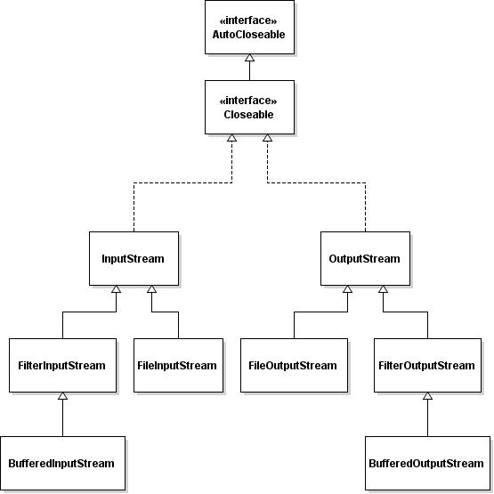
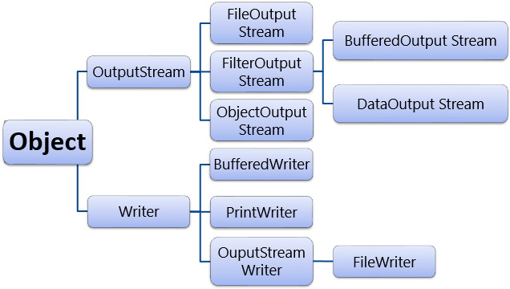

# NHẬP XUẤT FILE & UNIT TEST
## 1. XỬ LÍ FILE TRONG JAVA

### 1.1 Các luồng dữ liệu


#### Có 2 luồng trong Java:

#### Kiến trúc InputStream

#### Kiến trúc OutputStream


#### Phân biệt


### 1.2 Đọc ghi file trong Java - các thao tác xử lí
>**Bước 1:** Tạo đối tượng luồng và liên kết với nguồn dữ liệu.
**Bước 2:** Thao tác dữ liệu (đọc hoặc ghi hoặc cả hai).
**Bước 3:** Đóng luồng.

#### 1.2.1 Xử lí nhập xuất dữ liệu sử dụng luồng Byte (BinaryFile)

- Sử dụng luồng byte trong các trường hợp như nhập xuất kiểu dữ liệu nguyên thủy (như kiểu int, float, double, boolean), nhập xuất kiểu dữ liệu kiểu đối tượng (object).
- Đọc và ghi dữ liệu nhị phân (binary data):

- Tổng quan về luồng nhị phân

#### 1.2.2 Class InputStream & OutputStream
Class InputStream là một class trừu tượng vì vậy bạn không thể khởi tạo đối tượng InputStream thông qua chính class InputStream. Tuy nhiên class này rẽ ra nhiều nhánh thông qua các class con thừa kế nó. Tùy vào các tình huống bạn có thể tạo đối tượng InputStream từ các Constructor của các class con.

```java
// java.io.InputStream là một class trìu tượng (abstract class)
// Không thể khởi tạo trực tiếp đối tượng InputStream thông qua class InputStream
// Nên khởi tạo đối tượng InputStream thông qua các class con của nó ..

InputStream fileStream =new FileInputStream("C:/test.txt");

// Luồng đầu vào từ bàn phím..
InputStream is = System.in;
```

Class OutputStream là một class trìu tượng vì vậy bạn không thể khởi tạo đối tượng OutputStream thông qua chính class OutputStream .Tuy nhiên class này rẽ ra nhiều nhánh thông qua các class con thừa kế nó và quan trọng .Tùy vào các tình huống bạn có thể tạo đối tượng InputStream từ cấu tử của các class con.

```java
// java.io.OutputStream là một class trìu tượng (abstract class)
// Không thể khởi tạo trực tiếp đối tượng OutputStream thông qua class OutputStream
// Nên khởi tạo đối tượng OutputStream thông qua các class con của nó ..

// Luồng ghi dữ liệu vào file
OutputStream os=new FileOutputStream("D:/outData.txt");

// Luồng ghi ra màn hình Console.
OutputStream w=System.out;
```

VD về đọc giá trị từ file có sẵn:
```java
public class HelloInputStream {

  public static void main(String[] args) {
      try {

          // Tạo một đối tượng InputStream theo class con của nó.
          // Đây là luồng đọc một file.
          InputStream is = new FileInputStream("data.txt");

          int i = -1;

          // Đọc lần lượt các byte trong luồng.
          // Mỗi lần đọc ra 8bit, chuyển nó thành số int.
          // Khi đọc ra giá trị -1 nghĩa là kết thúc luồng.

          while ((i = is.read()) != -1) {
              System.out.println(i + "  " + (char) i);
          }
          is.close();
      } catch (Exception e) {
          System.out.println("File không tồn tại!");
      }
  }
}
```
Vd về ghi giá trị vào file có sẵn:
```java
public class HelloOutputStream {

  public static void main(String[] args) {
      try {
          File dir = new File("C:/Test");
          // Tao thu muc C:/Test
          dir.mkdirs();
          // Tạo một luồng ký tự đầu ra với mục đích ghi thông tin vào file
          OutputStream w = new FileOutputStream(
                  "C:/Test/test_outputStream.txt");
         
         
          // Tạo một mảng byte ,ta sẽ ghi các byte này vào file nói trên .
          byte[] by = new byte[] { 'H', 'e', 'l', 'l', 'o' };

          // Ghi lần lượt các ký tự vào luồng
          for (int i = 0; i < by.length; i++) {
              byte b = by[i];
              // Ghi ký tự vào luồng
              w.write(b);
          }
          // Đóng luồng đầu ra lại việc ghi xuống file hoàn tất.
          w.close();
      } catch (Exception e) {
          e.printStackTrace();
      }
  }
}
```

..............................................................
## 2. Assertions
### 2.1 Assertions trong JAVA là gì?
- Assertion trong  Java cho phép chúng ta kiểm tra tính đúng đắn của bất kỳ giả định nào đã được thực hiện trong chương trình. Chúng ta có thể đạt được nó bằng cách sử dụng câu lệnh khẳng định trong Java. Trong khi thực hiện một xác nhận, chúng tôi giả định nó là đúng.
- Nếu xác nhận không thành công, thì JVM sẽ ném ra lỗi AssertionError.
- Do đó, chúng tôi sử dụng nó cho mục đích thử nghiệm trong quá trình phát triển. Chúng ta có thể sử dụng câu lệnh khẳng định với biểu thức Boolean và có thể viết theo hai cách khác nhau như sau:
  - Khẳng định biểu thức;
  - Khẳng định biểu thức1: biểu thức2;
### 2.2 Tại sao phải dùng Assertion trong JAVA
- Sự khác biệt giữa Assertion và ngoại lệ thông thường là các xác nhận thường bị vô hiệu hóa tại thời điểm chạy.
- Assertion được sử dụng bất kỳ khi nào kỹ sư phần mềm muốn kiểm tra tính đúng sai của một vấn đề trong lập trình Java.
  - Để đảm bảo rằng một mã không thể truy cập thực sự không thể truy cập được
  - Để đảm bảo rằng các giá trị giả định được viết trong các nhận xét là đúng
  - Để đảm bảo rằng trường hợp chuyển đổi mặc định không được thực thi
  - Kiểm tra trạng thái của đối tượng
  - Sử dụng tại điểm, bắt đầu của phương thức
### 2.3 Nơi sử dụng Assertion

- Đầu tiên, ta có thể sử dụng Java Assertions trong các đối số cho các phương thức private. Mã của nhà phát triển chỉ cung cấp các đối số riêng và nhà phát triển có thể muốn kiểm tra các giả định của mình về các đối số.
- Thứ hai, các xác nhận cũng có thể được sử dụng trong các giả định của mình về các đối số.
- Cuối cùng, chúng ta có thể sử dụng chúng trong điều kiện ở bất kỳ phương pháp nào.
### 2.4 Nơi không sử dụng Assertion trong Java
- Thay thế các thông báo lỗi.
- Để kiểm tra các đối số trong các phương thức công khai vì chúng có thể được cung cấp bởi người dùng.
- Để xử lý các lỗi do người dùng cung cấp, đối với điều này, chúng tôi phải sử dụng xử lý lỗi.

>Lớp AssertionError mở rộng lớp Lỗi và lớp Lỗi tự mở rộng có thể ném. Điều này có nghĩa là AssertionError là một ngoại lệ không được chọn.

Do đó, chúng ra không cần khai báo các phương thức sử dụng assertion và hơn nữa việc gọi mã cũng không cần phải thử và bắt chúng. 

>Chúng ta sử dụng AssertionErrors để chỉ ra các điều kiện không thể khôi phục trong một ứng dụng, vì vậy chúng ta không nên cố gắng xử lý hoặc khôi phục chúng.

## 3. Unit Test
### 3.1 Unit Test là gì?
- Trong kiểm thử phần mềm có 4 mức độ kiểm thử: Unit test ( kiểm thử mức đơn vị), Intergration test ( kiểm thử tích hợp), System test (kiểm thử hệ thống), Acceptance test (kiểm thử chấp nhận).
- Unit test là mức độ kiểm thử nhỏ nhất trong quy trình kiểm thử phần mềm. Unit test kiểm thử các đơn vị nhỏ nhất trong mã nguồn như method, class, module...Do đó Unit test nhằm kiểm tra mã nguồn của các chương trình, các chức năng riêng rẽ hoạt động đúng hay không.
### 3.2 Lợi ích của Unit Test
- Viết Unit test tốt giúp tăng sự tin tưởng vào mã nguồn được thay đổi hoặc bảo trì. Bởi lẽ, nếu viết Unit test tốt, mỗi lần có sự thay đổi bên trong mã nguồn và chạy unit test, chúng ta có thể bắt được những lỗi sảy ra do thay đổi mã nguồn.
- Chúng ta có thể kiểm thử từng thành phần riêng rẽ của dự án mà không cần đợi các thành phần khác hoàn thành.
- Do thực hiện test trên từng đơn vị nhỏ của các module riêng rẽ nên khi phát hiện lỗi cũng dễ dàng khoanh vùng và sửa chữa.
- Có thể tái sử dụng mã nguồn
- Chi phí cho việc sửa chữa lỗi trong giai đoạn unit test sẽ ít hơn so với các giai đoạn sau
- Mã nguồn đáng tin cậy hơn nếu viết tốt unit test
### 3.3 Những ngộ nhận về Unit Test
- Nhiều lập trình viên cho rằng không bắt buộc phải có Unit test. Nhiều người tin tưởng rằng khả năng lập trình của họ đã tốt và phần mềm của họ không cần thiết phải có Unit test. Nhưng trong thế giới thực tế này, tất cả mọi người đều có thể gây ra lỗi và các hệ thống phần mềm thực tế còn phức tạp hơn rất nhiều.
- Viết Unit test mất quá nhiều thời gian: Lập trình viên thường cho rằng unit test với họ là vô nghĩa bởi lẽ họ nghĩ rằng mã nguồn sẽ luôn luôn được kiểm thử bởi kiểm thử viên. Tuy nhiên, nếu không thực hiện Unit test, số lỗi được tìm thấy ở các giai đoạn sau càng nhiều và càng ở giai đoạn sau thì lỗi càng phức tạp, tốn rất nhiều thời gian và chi phí để sửa chữa.
### 3.4 Một số lưu ý khi viết Unit Test
- Chắc chắn rằng mỗi test case kiểm thử mức đơn vị sẽ độc lập với những test case khác. Không nên gọi một test case khác trong một test case. Test case không nên phụ thuộc vào nhau cả về data và thứ tự thực hiện.
- Luôn luôn kiểm tra từng mô-đun một cách độc lập. Nếu không, sẽ có nhiều sự chồng chéo giữa các ca thử nghiệm và việc thay đổi đối với một đơn vị có thể ảnh hưởng đến tất cả các mô-đun khác và khiến phần mềm bị lỗi.
- Đặt tên các đơn vị kiểm thử một cách rõ ràng và nhất quán. Đảm bảo rằng các test case dễ đọc, bất kỳ ai cũng có thể chọn test case và chạy nó mà không gặp bất kỳ vấn đề nào.
- Khi triển khai việc thay đổi giao diện hoặc chức năng, cần chạy lại các test case trước đó nhằm đảm bảo việc thay đổi này không làm ảnh hưởng đến những test case cũ đã pass.
- Luôn đảm bảo lỗi được xác định trong quá trình Unit test được sửa trước khi chuyển sang giai đoạn tiếp theo.
- Không cố gắng viết test case để kiểm thử tất cả mọi thứ, thay vào đó nên tập chung vào kiểm thử sự ảnh hưởng của hành vi hệ thống
- Bên cạnh viết test case để test hành vi hệ thống, cần viết thêm test case để kiểm thử hiệu năng của mã nguồn
- Các testsuit nên đặt riêng ra, độc lập code với module
- Không nên có nhiều assert trong một test case vì khi một điều kiện không thỏa mãn thì các assert khác sẽ bị bỏ qua
- Sau một thời gian dài, số lượng test case nhiều, thời gian chạy lớn. Nên chia ra nhóm test case cũ và test case mới, test case cũ sẽ chạy với tần xuất ít hơn
