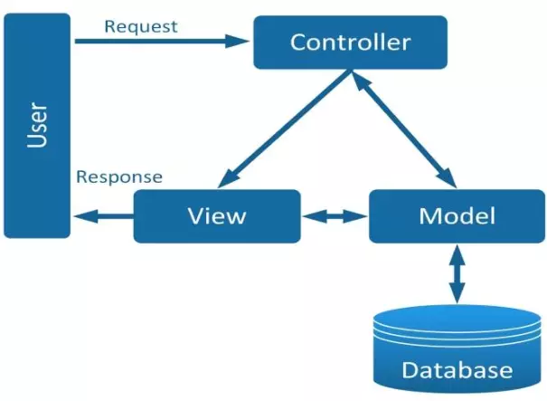

# CÁC NGUYÊN TẮC THIẾT KẾ, MÔ HÌNH THIẾT KẾ
## 1. SOLID

### 1.1 Định nghĩa
- SOLID là viết tắt của 5 chữ cái đầu trong 5 nguyên tắc thiết kế hướng đối tượng. Giúp cho lập trình viên viết ra những đoạn code dễ đọc, dễ hiểu, dễ maintain. Nó được đưa ra bởi Robert C. Martin và Michael Feathers. 5 nguyên tắc đó bao gồm:
  - Single responsibility priciple (SRP)
  - Open/Closed principle (OCP)
  - Liskov substitution principe (LSP)
  - Interface segregation principle (ISP)
  - Dependency inversion principle (DIP)

### 1.2 Single responsibility principle 
>Mỗi lớp chỉ nên chịu trách nhiệm về một nhiệm vụ cụ thể nào đó mà thôi.

- Nguyên lý đầu tiên ứng với chữ S trong SOLID, có ý nghĩa là một class chỉ nên giữ một trách nhiệm duy nhất.
- Một class có quá nhiều chức năng sẽ trở nên cồng kềnh và trở nên khó đọc, khó maintain.
- Mà đối với ngành IT việc requirement thay đổi, cần thêm sửa chức năng là rất bình thường, nên việc code trong sáng, dễ đọc dễ hiểu là rất cần thiết.

Ví dụ: Hình dung rằng nhân viên của một công ty phần mềm cần phải làm 1 trong 3 việc sau đây: lập trình phần mềm (developer), kiểm tra phần mềm (tester), bán phần mềm (salesman). Mỗi nhân viên sẽ có một chức vụ và dựa vào chức vụ sẽ làm công việc tương ứng. Khi đó bạn có nên thiết kế lớp “Employee” với thuộc tính “position” và 3 phương thức developSoftware(), testSoftware() và saleSoftware() không?

=> Câu trả lời là KHÔNG. Thử hình dung nếu có thêm một chức vụ nữa là quản lí nhân sự, ta sẽ phải sửa lại lớp “Employee”, thêm phương thức mới vào sao? Nếu có thêm 10 chức vụ nữa thì sao? Khi đó các đối tượng được tạo ra sẽ dư thừa rất nhiều phương thức: Developer thì đâu cần dùng hàm testSoftware() và saleSoftware() đúng không nào, lỡ may dùng lầm phương thức cũng sẽ gây hậu quả khôn lường.
> **Áp dụng nguyên tắc Single Responsibility**: mỗi lớp 1 trách nhiệm. Ta sẽ tạo 1 lớp trừu tượng là “Employee” có phương thức là working(), từ đây bạn kế thừa ra 3 lớp cụ thể là Developer, Tester và Salesman. Ở mỗi lớp này bạn sẽ implement phương thức working() cụ thể tuy theo nhiệm vụ của từng người. Khi đó chúng ta sẽ bị tình trạng dùng nhầm phương thức nữa.

### 1.3 Open/Closed principle
> Không được sửa đổi một Class có sẵn, nhưng có thể mở rộng bằng kế thừa.

Thông thường việc mở rộng thêm chức năng thì phải viết thêm code, vậy để thiết kế ra một module có thể dễ dàng mở rộng nhưng lại hạn chế sửa đổi code ta cần làm gì. Cách giải quyết là tách những phần dễ thay đổi ra khỏi phần khó thay đổi mà vẫn đảm bảo không ảnh hưởng đến phần còn lại.
### 1.4 Liskov substitution principle
> Các đối tượng (instance) kiểu class con có thể thay thế các đối tượng kiểu class cha mà không gây ra lỗi.

Quay trở lại ví dụ lớp Emloyee trong phần 1, ta giả sử có công ty sẽ điểm danh vào mỗi buổi sáng, và chỉ có các nhân viên thuộc biên chế chính thức mới được phép điểm danh. Ta bổ sung phương thức checkAttendance() vào lớp Employee.

**Hình dung có một trường hợp sau:** công ty thuê một nhân viên lao công để làm vệ sinh văn phòng, mặc dù là một người làm việc cho công ty nhưng do không được cấp số ID nên không được xem là một nhân viên bình thường, mà chỉ là một nhân viên thời vụ, do đó sẽ không được điểm danh.

**Nguyên tắc này nói rằng:** Nếu chúng ta tạo ra một lớp CleanerStaff kế thừa từ lớp Employee, và implement hàm working() cho lớp này, thì mọi thứ đều ổn, tuy nhiên lớp mới này cũng lại có hàm checkAttendance() để điểm danh, mà như thế là sai quy định dẫn đến chương trình bị lỗi. Như vậy, thiết kế lớp CleanerStaff kế thừa từ lớp Employee là không được phép.

### 1.5 Interface segregation principle
> Thay vì dùng 1 interface lớn, ta nên tách thành nhiều interface nhỏ, với nhiều mục đích cụ thể.

Nguyên lý này rất dễ hiểu. Hãy tưởng tượng chúng ta có 1 interface lớn, khoảng 100 methods. Việc implements sẽ rất vất vả vì các class impliment interface này sẽ bắt buộc phải phải thực thi toàn bộ các method của interface. Ngoài ra còn có thể dư thừa vì 1 class không cần dùng hết 100 method. Khi tách interface ra thành nhiều interface nhỏ, gồm các method liên quan tới nhau, việc implement và quản lý sẽ dễ hơn.
### 1.6 Dependency inversion principle
> 1.Các module cấp cao không nên phụ thuộc vào các modules cấp thấp. Cả 2 nên phụ thuộc vào abstraction.
2.Interface (abstraction) không nên phụ thuộc vào chi tiết, mà ngược lại (Các class giao tiếp với nhau thông qua interface (abstraction), không phải thông qua implementation.)

- Có thể hiểu nguyên lí này như sau: những thành phần trong 1 chương trình chỉ nên phụ thuộc vào những cái trừu tượng (abstraction). Những thành phần trừu tượng không nên phụ thuộc vào các thành phần mang tính cụ thể mà nên ngược lại.
- Những cái trừu tượng (abstraction) là những cái ít thay đổi và biến động, nó tập hợp những đặc tính chung nhất của những cái cụ thể. Những cái cụ thể dù khác nhau thế nào đi nữa đều tuân theo các quy tắc chung mà cái trừu tượng đã định ra. Việc phụ thuộc vào cái trừu tượng sẽ giúp chương trình linh động và thích ứng tốt với các sự thay đổi diễn ra liên tục.

## 2.KISS, DRY, YAGNI

### 2.1 YAGNI
> YAGNI = You Aren’t Gonna Need It

Nguyên tắc này là dự án của bạn đang làm thì chỉ cần tập trung xây dựng chức năng quyết vấn đề ở thời điểm hiện tại, vấn đề mà khách hàng cần giải quyết, không cần lãng phí thời gian vào một chức năng "Có thể sử dụng đến".
=>  Đừng tự vẽ việc cho mình.

### 2.2 KISS
> KISS = Keep It Simple Stupid
- KISS có nhiều biến thể khác nhau như "Keep It Short and Simple", "Keep It Simple and Straightforward" và "Keep It Small and Simple".
- Tóm lại, hàm ý của nó vẫn hướng về một sự đơn giản và rõ ràng trong mọi vấn đề. Và như vậy, sự đơn giản là mục đích trọng tâm trong thiết kế, còn những cái phức tạp không cần thiết thì nên tránh.
- Hãy để số lượng dòng code của một lớp hay phương thức ở con số hàng chục thôi.

### 2.3 DRY
> DRY = Don’t Repeat Yourself

Nguyên tắc này có nghĩa là đừng có viết lặp bất kỳ lại một đoạn mã nào mà hãy đóng gói nó thành phương thức riêng. Đến khi cần thì chỉ cần gọi tên nó ra.

## 3. Mô hình MVC

### 3.1 Định nghĩa
- MVC là viết tắt của cụm từ “Model-View-Controller“.
- Đây là mô hình thiết kế được sử dụng trong kỹ thuật phần mềm.
- MVC là một mẫu kiến trúc phần mềm để tạo lập giao diện người dùng trên máy tính.
- MVC chia thành ba phần được kết nối với nhau và mỗi thành phần đều có một nhiệm vụ riêng của nó và độc lập với các thành phần khác.
- MVC cũng được sử dụng rộng rãi trong phát triển web, sự khác biệt được tùy chỉnh liên quan đến sự có mặt của server - client.

### 3.2 Thành phần trong MVC

#### 3.2.1 Model
- Có nhiệm vụ thao tác với Database
- Nó chứa tất cả các hàm, các phương thức truy vấn trực tiếp với dữ liệu
- Controller sẽ thông qua các hàm, phương thức đó để lấy dữ liệu rồi gửi qua View

#### 3.2.2 View
- Là giao diện người dùng (User Interface).
- Chứa các thành phần tương tác với người dùng như menu, button, image, text,...
- Nơi nhận dữ liệu từ Controller và hiển thị.
#### 3.2.3 Controller
- Là thành phần trung gian giữa Model và View
- Đảm nhận vai trò tiếp nhận yêu cầu từ người dùng, thông qua Model để lấy dữ liệu sau đó thông qua View để hiển thị cho người dùng

### 3.3 Luồng xử lí trong MVC
- Luồng xử lý trong MVC rất đơn giản thôi, với web nó gồm các bước như sau:
  - Đầu tiên là Request từ người dùng được gửi từ client đến server (Xem thêm nếu bạn chưa biết về Request)
  - Sau đó Controller dựa vào yêu cầu của người dùng tiến hành giao tiếp với Model để lấy data từ database
  - Cuối cùng Controller gửi dữ liệu vừa lấy được về View và hiển thị ra cho người dùng trên trình duyệt

### 3.4 Tại sao sử dụng MVC
- **Sự độc lập và phát triển song song**: Vì mỗi thành phần trong MVC có nhiệm vụ riêng và độc lập với nhau, nên mỗi developer có thể đảm nhiệm một thành phần và không ảnh hưởng đến nhau khiến quá trình phát triển diễn ra nhanh chóng, dễ dàng.
- **Hỗ trợ bất đồng bộ**: Kỹ thuật bất đồng bộ khiến các ứng dụng được load nhanh hơn đơn giản vì tiến hành chạy nhiều câu lệnh cùng lúc
- **MVC thân thiện với SEO**: Nền tảng MVC hỗ trợ phát triển các trang web thân thiện với SEO. Bằng nền tảng này, bạn có thể dễ dàng phát triển các URL thân thiện với SEO để tạo ra nhiều lượt truy cập hơn.
### 3.5 Áp dụng MVC vào project thực tế.
[Mô hình MVC](https://www.youtube.com/watch?v=N8GhaR7K3tI&list=PL_-VfJajZj0VatBpaXkEHK_UPHL7dW6I3&index=17).
[Routes & Controlers](https://www.youtube.com/watch?v=Pd_ZIpCVZPc&list=PL_-VfJajZj0VatBpaXkEHK_UPHL7dW6I3&index=18)
