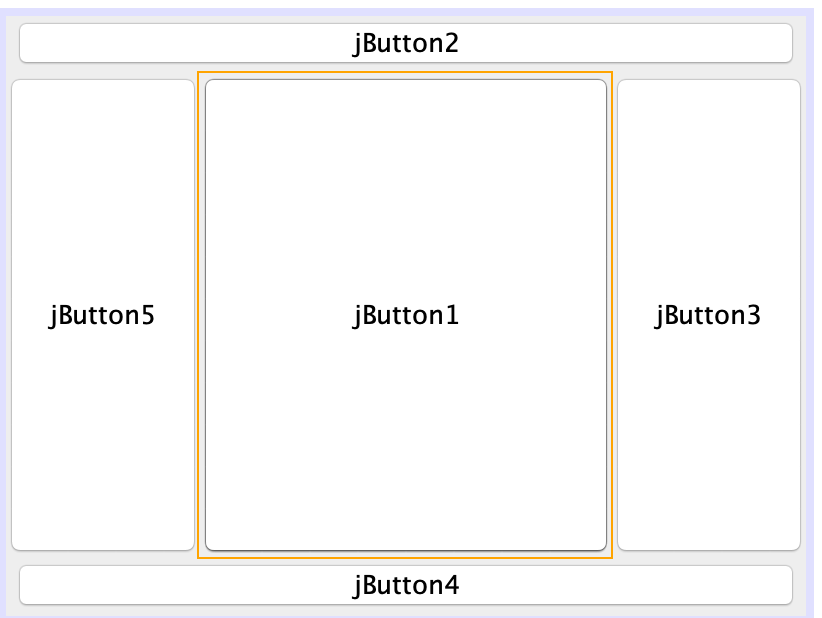
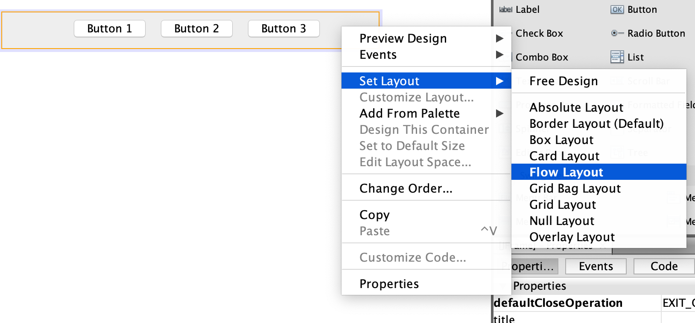
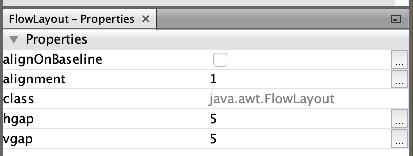
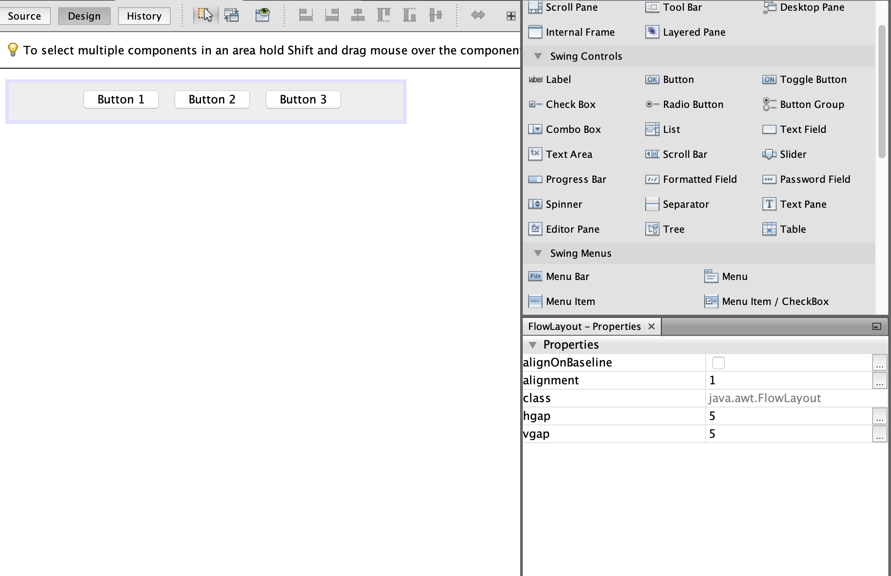

# THƯ VIỆN ĐỒ HỌA SWING

## 1. Thư viện đồ họa swing cơ bản

**Swing** là thư viện các đối tượng để lập trình giao diện đồ hoạ trong Java. Trước đây thư viện AWT là thư viện tiêu chuẩn cho lập trình giao diện, sau này Swing được phát triển kế thừa một số lớp của AWT, hoạt động nhẹ hơn và độc lập với nền tảng thiết bị, và bổ sung thêm nhiều lớp hiển thị mạnh mẽ hơn.

Mỗi thành phần trong Swing được gọi là `component`. `Component` được chia làm 2 loại:
- Loại khung chứa: là những component định nghĩa khung chứa các component khác bên trong. Các component loại này ko thực hiện chức năng hiển thị nội dung, mà chỉ định nghĩa kích thước, nền, cách sắp xếp và hiển thị các component bên trong. Các component khung chứa thường dùng như JFrame, JPanel, JDialog, …
- Loại hiển thị: là những component đơn vị thực hiện chức năng hiển thị nội dung. Các component hiển thị thường dùng như JLabel, JButton, JList, JTextField, …

#### 1.1 Cách tổ chức code khi lập trình giao diện :
Các bạn xem các ví dụ mẫu trên mạng thấy rằng ngta đều tống hết code vào trong 1 file. Điều này giúp bạn dễ nhìn, dễ tiếp cận ở những ví dụ đầu, nhưng cách làm này ko tốt cho sự phát triển về sau, khi mà số lượng component tăng.

| src
|– gui
| — | — panel
| — | — | — MainPanel.java
| — | — Gui.java
| — | — ICommon.java
| — logic
| — | — Logic.java
| — main
| — | — Main.java

trong đó “ICommon” là interface định nghĩa 3 phương thức initComponent(), addComponent() và addEvent(). Sau này các Panel và Frame sẽ implement interface này để chúng ta thuận tiện cài đặt và thêm các component bên trong, tránh viết lộn xộn.
```java
public interface ICommon {
  void initComp();
  void addComp();
  void addEvent();
}
```

“Gui” là lớp định nghĩa Frame và thêm Panel vào trong Frame đó.

```java
public class Gui extends JFrame implements ICommon {
  private MainPanel mainPanel;
 
  public Gui {
    initComp();
    addComp();
    addEvent();
  }
 
  @Override
  public void initComp() {
    // cài đặt ban đầu cho Frame
    setSize(500, 400);
    setLayout(new CardLayout());
    setLocationRelativeTo(null);
    setDefaultCloseOperation(EXIT_ON_CLOSE);
  }
 
  @Override
  public void addComp() {
    // thêm Panel vào Frame
    mainPanel = new MainPanel();
    add(mainPanel);
  }
 
  @Override
  public void addEvent() {
    // thêm sự kiện
  }
}
```

“MainPanel” là lớp định nghĩa Panel trong Frame và thêm các component hiển thị trong nó.
```java
public class MainPanel extends JPanel implements ICommon {
  private JButton btnCount;
  private JLabel lbCount;
  private int count;
 
  public MainPanel {
    count = 0;
    initComp();
    addComp();
    addEvent();
  }
 
  @Override
  public void initComp() {
    // cài đặt ban đầu cho Panel
    setLayout(null);
  }
 
  @Override
  public void addComp() {
    // cài đặt và thêm Button btnCount vào Panel
    btnCount = new JButton();
    btnCount.setText("Click");
    btnCount.setSize(100, 50);
    btnCount.setLocation(10, 10);
    add(btnCount);
 
    // cài đặt và thêm Label lbCount vào Panel
    lbCount = new JLabel();
    lbCount.setText(count + "");
    lbCount.setSize(100, 50);
    lbCount.setLocation(120, 10);
    add(lbCount);
  }
 
  @Override
  public void addEvent() {
    btnCount.addActionListener(new ActionListener() {
      @Override
      public void actionPerformed(ActionEvent e) {
        count++;
        lbCount.setText(count);
      }
    });
  }
}
```

Còn “Main” chỉ đơn giản là chứa phương thức main() để tạo đối tượng Frame.
```java
public class Main {
  public static void main(String[] args) {
    Gui gui = new Gui();
    gui.setVisible(true);
  }
}
```

#### 1.2 Cách sử dụng một số component :

###### 1.2.1 Các component đều có các phương thức cơ bản sau:
`setSize(width, height)` : cài đặt kích thước.
`setLocation(x, y)` : cài đặt vị trí (lấy vị trí góc trên bên trái làm gốc).
`setBound(x, y, width, height)` : là phương thức ghép chung cả setLocation và setSize.
`setBackground(color)` : cài đặt màu nền. Có 2 cách truyền tham số màu: hoặc là dùng màu được quy ước sẵn trong lớp Color, ví dụ như “Color.white”, hoặc tạo một đối tượng Color, ví dụ “new Color(255, 0, 0)”. Có nhiều cách truyền tham số để khởi tạo đối tượng Color, các bạn tham khảo thêm.
`setForeground(color)` : cài đặt màu chữ.
`setVisible(boolean)` : cài đặt ẩn hay hiện. Thường thì chỉ Frame hay Window bắt buộc phải thiết lập “setVisible(true)”, còn các component khác thì mặc định thiết lập này true rồi.

###### 1.2.2 JFrame
`setTitle("Title")` : cài đặt tên tiêu đề.
`setLocationRelativeTo(null)` : đặt cho cửa sổ xuất hiện ở giữa màn hình.
`setResizable(false)` : cài đặt ko cho phép kéo thả thay đổi kích thước cửa sổ.
`setDefaultCloseOperation(DO_NOTHING_ON_CLOSE)` : lựa chọn ko làm gì khi bạn nhấn nút đóng cửa sổ (nút chéo đỏ). Bạn có thể đặt giá trị “EXIT_ON_CLOSE” để thoát chương trình khi nhấn nút đóng, tuy nhiên cách này ko nên dùng vì ko phải lúc nào nó cũng thoát hoàn toàn. **Cách tốt nhất là chúng ta viết xử lý sự kiện riêng (mình sẽ trình bày sau).**
`setLayout(layout)` : cài đặt cách bố trí các component trong container. **Về các loại Layout mình sẽ trình bày sau.**
`add(component)` : sau khi khởi tạo component thì chúng ta thêm component đó vào container, ví dụ “add(mainPanel)”. Lưu ý phải thêm vào khung chứa thì component đó mới được hiển thị.

###### 1.2.3 JPanel
`setLayout(layout)` : tương tự JFrame.
`add(component)` : tương tự JFrame.
###### 1.2.4 JLabel 
`setText("Số lần bấm: " + count)` : đặt nội dung text cần hiển thị.
`setFont(new Font("VNI", Font.PLAIN, 24))` : cài đặt font.

`setOpaque(true)` : mặc định màu nền của Label là trong suốt, đó là bạn phải cài đặt tính đục bằng true thì phương thức cài đặt màu nền `setBackground` mới có hiệu lực.

`setHorizontalAlignment(JLabel.CENTER)` : căn text vào giữa Label theo hàng ngang.
`setVerticalAlignment(JLabel.CENTER)` : căn text vào giữa Label theo hàng dọc.
Bạn có thể truyền giá trị `JLabel.RIGHT` để căn sang lề phải.
###### 1.2.5 JButton 
`setText("Bấm vào đây")` : đặt nội dung text cần hiển thị.

`setFont(font)` : tương tự.

###### 1.2.6 JTextField
`setText()` : tương tự.

`setFont()` : tương tự.

`setEnabled(false)` : ngăn ko cho chỉnh sửa nội dung text từ bên ngoài.
###### 1.2.6 JTextArea
`setText()` : tương tự.

`setFont()` : tương tự.

`setEnabled()` : tương tự.

`setLineWrap(true)` : cài đặt xuống dòng khi tràn chiều dài khung text, tuy nhiên nó ko cắt nguyên vẹn từ xuống dòng mới đâu.

`setWrapStyleWord(true)` : cho phép cắt nguyên vẹn từ xuống dòng mới.

###### 1.2.7 JList
- JList là một component hiển thị danh sách các đối tượng, cho phép người dùng chọn được item.
- Bản thân JList chỉ là thành phần hiển thị. Để nạp dữ liệu cho JList hiển thị, cần có đối tượng model để chứa dữ liệu đó là DefaultListModel. Thông thường để truyền dữ liệu vào model cần có mảng dữ liệu, mảng đó là kết quả của các quá trình tìm kiếm, sắp xếp. Con đường dữ liệu được hiển thị ra JList như sau:

ArrayList –> DefaultListModel –> JList
- Ngoài ra JList thường phải đặt trong một loại component khung chứa là JScrollPane, vì JList ko hỗ trợ thanh cuộn, thanh cuộn là do JScrollPane cung cấp.

```java
private DefaultListModel lstModelStudent;
private JList lstStudent;
private JScrollPane scroll;
....
lstStudent = new JList();
scroll = new JScrollPane(lstStudent);
add(scroll);
updateDataListModelStudent();
....
private void updateDataListModelStudent() {
  ArrayList listStudent = manager.getListStudent();
  lstModelStudent = new DefaultListModel();
  for (Student item : listStudent) {
    lstModelStudent.addElement(item);
  }
  lstStudent.setModel(lstModelStudent);
}
```
>***JList ko có khả năng hiển thị nhiều trường (thuộc tính) của đối tượng trên cùng một hàng. Muốn hiển thị được nhiều trường, bạn chuyển qua dùng component JTable.***

###### 1.2.8 JTable 
- Tương tự JList, con đường hiển thị dữ liệu ra màn hình như sau:

ArrayList –> DefaultTableModel –> JTable

```java
private static final String COLUMN_NAME = {"Mã HS", "Tên", "Tuổi"};
private DefaultTableModel tbModelStudent;
private JTable tbStudent;
private JScrollPane scroll;
....
tbStudent = new JTable();
scroll = new JScrollPane(tbStudent);
add(scroll);
updateDataTableModelStudent();
....
private void updateDataTableModelStudent() {
  ArrayList listStudent = manager.getListStudent();
  tbModelStudent = new DefaultTableModel(COLUMN_NAME, 0);
  for (Student item : listStudent) {
    String[] arr = new String[3];
    arr[0] = item.getId();
    arr[1] = item.getName();
    arr[2] = item.getAge();
    tbModelStudent.addRow(arr);
  }
  tbStudent.setModel(tbModelStudent);
}
```

>***JTable chỉ có khả năng hiển thị dữ liệu dạng String, nên với dữ liệu kiểu số hay boolean thì các bạn nhớ chuyển đổi thành chuỗi nhé.***

###### 1.2.9 JComboBox
Tương tự JList, chỉ khác là nó hiển thị danh sách dạng sổ xuống và có thuộc tính lựa chọn.

ArrayList –> DefaultComboBoxModel –> JComboBox

```java
private DefaultComboBoxModel cbbModelStudent;
private JComboBox cbbStudent;
....
cbbStudent = new JComboBox();
add(cbbStudent);
updateDataComboBoxModelStudent();
....
private void updateDataComboBoxModelStudent() {
  ArrayList listStudent = manager.getListStudent();
  cbbModelStudent = new DefaultComboBoxModel();
  for (Student item : listStudent) {
    cbbModelStudent.addElement(item);
  }
  cbbStudent.setModel(cbbModelStudent);
}
```

JComboBox ko cần JScrollPane làm khung.
`getSelectedIndex()` : trả về chỉ số của lựa chọn.

###### 1.3 Xử lí sự kiện
Đóng cửa sổ (đóng Frame)
```java
WindowListener wd = new WindowAdapter() {
  @Override
  public void windowClosing(WindowEvent e) {
    int kq = JOptionPane.showConfirmDialog(Gui.this, "Bạn có muốn thoát không?", "Thông báo", JOptionPane.YES_NO_OPTION);
    if (kq == JOptionPane.YES_OPTION) {
      dispose();
    }
  }
};
addWindowListener(wd);
```

Click chuột vào Label
```java
label.addMouseListener(new MouseAdapter() {
  @Override
  public void mouseReleased(MouseEvent e) {
    if (e.getButton() == MouseEvent.BUTTON1) {
      label.setText("Chuột trái click");
    } else if (e.getButton() == MouseEvent.BUTTON3) {
      label.setText("Chuột phải click");
    }
  }
});
```
Chọn, bỏ chọn CheckBox
```java
checkBox.addItemListener(new ItemListener() {
  @Override
  public void itemStateChanged(ItemEvent e) {
    if (checkBox.isSelected()) {
      lbCheck.setText("This CheckBox has checked");
    } else {
      lbCheck.setText("This CheckBox has unchecked");
    }
  }
});
```
## 2. Một số layout thường gặp
#### 2.1 BorderLayout
- BorderLayout tổ chức các thành phần con thành 5 vùng NORTH, SOUTH, EAST, WEST and CENTER. Ở mỗi vùng chỉ có thể chứa tối đa một thành phần con, khi thêm các phần tử khác nhau vào BorderLayout bạn cần chỉ định 1 trong 5 vùng trên.

- Tương tự để chỉ định BorderLayout cho một container ta chỉ cần Click phải chuột -> Set Layout -> Border Layout.

- Tiến hành kéo thả 5 Button vào một JFrame có layout được đặt là BorderLayout.


Hoặc chúng ta có thể thực thi đoạn code dưới đây
```java
package com.company;
import javax.swing.JButton;
import javax.swing.JFrame;
import javax.swing.JPanel;
import java.awt.*;
public class Main {
    public static void main(String[] args) {
        // Create and set up a frame window
        JFrame.setDefaultLookAndFeelDecorated(true);
        JFrame frame = new JFrame("Layout");
        frame.setDefaultCloseOperation(JFrame.EXIT_ON_CLOSE);
        // Define the panel to hold the buttons 
        JPanel panel = new JPanel();
        JButton jb1 = new JButton("NORTH");
        JButton jb2 = new JButton("SOUTH");
        JButton jb3 = new JButton("WEST");
        JButton jb4 = new JButton("EAST");
        JButton jb5 = new JButton("CENTER");
        // Define the panel to hold the buttons
        panel.setLayout(new BorderLayout());
        panel.add(jb1, BorderLayout.NORTH);
        panel.add(jb2, BorderLayout.SOUTH);
        panel.add(jb3, BorderLayout.WEST);
        panel.add(jb4, BorderLayout.EAST);
        panel.add(jb5, BorderLayout.CENTER);
        // Set the window to be visible as the default to be false
        frame.add(panel);
        frame.pack();
        frame.setVisible(true);
    }
}
```

#### 2.2 FlowLayout
- FlowLayout bố trí các thành phần con theo hướng từ trái sang phải hoặc từ phải sang trái trên cùng một dòng. Nếu tất cả các thành phần con không thể chứa trên cùng một dòng so với chiều dài tối đa của container thì chúng sẽ được sắp xếp trên một hàng mới.
- Để khởi tạo một FlowLayout chúng ta có 3 constructor sau:
  - FlowLayout() – Tạo mới một FlowLayout object với các giá trị mặc định như canh giữa các thành phần con, khoảng cách ngang và dọc giữa các thành phần con là 5.
  - lowLayout(int align) – Tương tự như trên, tuy viên việc canh các phần tử ở giữa theo mặc định sẽ được ghi đè bởi giá trị align được truyền vào.
  - FlowLayout(int align, int hgap, int vgap) – Đây là constructor với đầy đủ các tham số chỉ định việc canh các phần tử, khoảng cách chiều ngang với hgap và chiều dọc vgap.
- Để chỉ định layout cho một container, ví dụ dụ JFrame trong Netbeans với giao diện kéo thả thì chúng ta chỉ cần Click phải chuột -> Set Layout, sau đó chọn layout tương ứng.
 
 - Sau khi gán layout thành công cho JFrame, chúng ta có thể chỉnh các thuộc tính canh chỉnh, khoảng cách giữa các thành phần con trong tab properties của FlowLayout.

Với giá trị alignment = 1 canh giữa các thành phần con, mình nắm và kéo thả 3 button vào sẽ được như sau:

Nếu không muốn sử dụng giao diện kéo thả thì chúng ta có thể code thông thường như sau:
```java
package com.company;
import javax.swing.JButton;
import javax.swing.JFrame;
import javax.swing.JPanel;
import java.awt.FlowLayout;
public class Main {
    public static void main(String[] args) {
        // Create and set up a frame window
        JFrame.setDefaultLookAndFeelDecorated(true);
        JFrame frame = new JFrame("Layout");
        frame.setDefaultCloseOperation(JFrame.EXIT_ON_CLOSE);
        // Define new buttons 
        JButton jb1 = new JButton("Button 1");
        JButton jb2 = new JButton("Button 2");
        JButton jb3 = new JButton("Button 3");
        // Define the panel to hold the buttons 
        JPanel panel = new JPanel();
        FlowLayout flowLayout = new FlowLayout();
        flowLayout.setAlignment(FlowLayout.LEFT);
        flowLayout.setHgap(10);
        panel.setLayout(flowLayout);
        panel.add(jb1);
        panel.add(jb2);
        panel.add(jb3);
        // Set the window to be visible as the default to be false
        frame.add(panel);
        frame.pack();
        frame.setVisible(true);
```
Ở đoạn code trên mình đã thay đổi cách canh chỉnh các phần tử phía bên trái, và khoảng cách bề ngang là 10 thay vì 5 như mặc định. Mình tin rằng nếu làm việc lâu hơn nữa với Swing thì các bạn có thể thích cách tự code hơn là sử dụng giao diện kéo thả của Netbeans vì code được sinh ra bởi Netbeans rất khó để chỉnh sửa và có những đoạn code các bạn không thể xoá đi được. 
#### 2.3 GridLayout
- Trình quản lý GridLayout được sử dụng để bố trí các thành phần trong một lưới hình chữ nhật, lưới này đã được chia thành các hình chữ nhật có kích thước bằng nhau và một thành phần được đặt trong mỗi hình chữ nhật. 
- Chúng ta có thể khởi tạo GridLayout thông qua các constructor sau:

`GridLayout()` – Tạo GridLayout với duy nhất một dòng và một cột
`GridLayout(int row, int col)` – Tạo GridLayout với row dòng và col cột.
`GridLayout(int row, int col, int hgap, int vgap)` – Tạo GridLayout với row dòng và col cột, các phần tử trên cùng một dòng cách nhau hgap và trên cùng một cột cách nhau vgap.

Với đoạn mã sau, chúng ta có thể tạo một đối tượng bố trí lưới với hai hàng, ba cột. Tương tự, chúng ta có thể thay đổi thứ tự của hai và ba để tạo đối tượng bố trí lưới ba hàng, hai cột.
```java
package com.company;
import javax.swing.*;
import java.awt.*;
public class GridLayoutExample {
    public static void main(String[] args) {
        // Create and set up a frame window
        JFrame.setDefaultLookAndFeelDecorated(true);
        JFrame frame = new JFrame("GridLayout Example");
        frame.setDefaultCloseOperation(JFrame.EXIT_ON_CLOSE);
        JButton jb1 = new JButton("Button 1");
        JButton jb2 = new JButton("Button 2");
        JButton jb3 = new JButton("Button 3");
        JButton jb4 = new JButton("Button 4");
        JButton jb5 = new JButton("Button 5");
        JPanel panel = new JPanel();
        panel.setLayout(new GridLayout(3, 2));
        panel.add(jb1);
        panel.add(jb2);
        panel.add(jb3);
        panel.add(jb4);
        panel.add(jb5);
        frame.add(panel);
        frame.pack();
        frame.setVisible(true);
    }
}
```

## 3. Graphics2D, Image
#### 3.1 Graphics
Dưới đây là một số phương thức được sử dụng phổ biến của lớp Graphics:

`public abstract void drawString(String str, int x, int y)`: được sử dụng để vẽ chuỗi đã cho.

`public void drawRect(int x, int y, int width, int height)`: vẽ một hình chữ nhật với độ rộng width và chiều cao height đã cho.

`public abstract void fillRect(int x, int y, int width, int height)`: được sử dụng để điền màu mặc định và độ rộng và chiều cao đã cho vào hình chữ nhật.

`public abstract void drawOval(int x, int y, int width, int height)`: được sử dụng để vẽ hình Ovan với độ rộng và chiều cao đã cho.

`public abstract void fillOval(int x, int y, int width, int height)`: được sử dụng để điền màu mặc định và độ rộng và chiều cao đã cho vào hình Oval.

`public abstract void drawLine(int x1, int y1, int x2, int y2)`: được sử dụng để vẽ line giữa hai điểm có tọa độ lần lượt là (x1, y1) và (x2, y2).

`public abstract boolean drawImage(Image img, int x, int y, ImageObserver observer)`: được sử dụng để vẽ hình ảnh đã cho.

`public abstract void drawArc(int x, int y, int width, int height, int startAngle, int arcAngle)`: được sử dụng để vẽ đường tròn circular hoặc elip.

`public abstract void fillArc(int x, int y, int width, int height, int startAngle, int arcAngle)`: được sử dụng để điền một hình tròn hoặc elip.
....
#### 3.2 Image
....

public abstract void setColor(Color c): được sử dụng để thiết lập màu hiện tại của đồ họa thành màu color đã cho.

public abstract void setFont(Font font): được sử dụng để thiết lập font hiện tại của đồ họa thành font đã cho.
