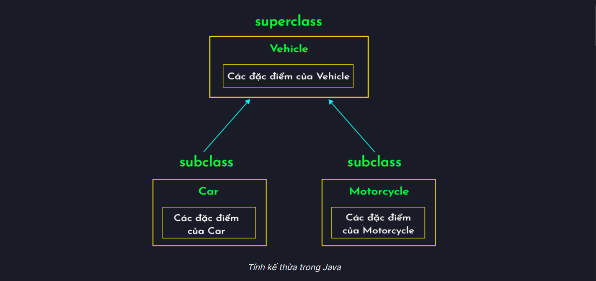
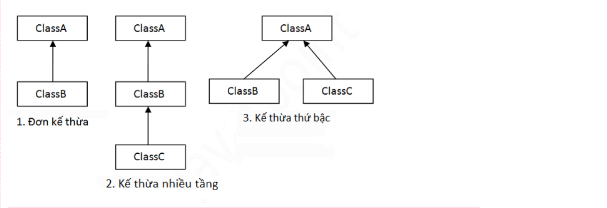
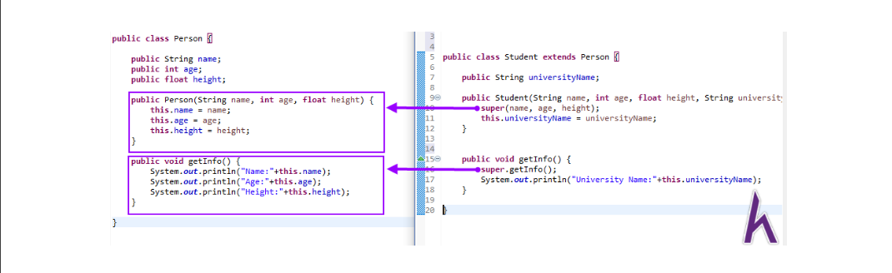

# Buổi 4: Mọi thứ đều là đối tượng

## 1. Tính đóng gói trong JAVA

>**Tính đóng gói trong java** là kỹ thuật ẩn giấu thông tin không liên quan và hiện thị ra thông liên quan. Mục đích chính của đóng gói trong java là giảm thiểu mức độ phức tạp phát triển phần mềm.

- Đóng gói cũng được sử dụng để bảo vệ trạng thái bên trong của một đối tượng. Bởi việc ẩn giấu các biến biểu diễn trạng thái của đối tượng. Việc chỉnh sửa đối tượng được thực hiện, xác nhận thông qua các phương thức. Hơn nữa, việc ẩn giấu các biến thì các lớp sẽ không chia sẻ thông tin với nhau được. Điều này làm giảm số lượng khớp nối có thể có trong một ứng dụng.

>**Lợi ích của tính đóng gói trong JAVA**

- Bạn có thể tạo lớp read-only hoặc write-only bằng việc cài đặt phương thức setter hoặc getter.
- Một lớp có thể có toàn bộ điều khiển thông qua những gì được lưu giữ trong các trường (field) của nó.
- Bạn có thể kiểm soát đối với dữ liệu. Giả sử bạn muốn đặt giá trị của id chỉ lớn hơn 100 bạn có thể viết logic bên trong lớp setter.

>**Ví Dụ**
```java
public class Student {
    private String name;
 
    public String getName() {
        return name;
    }
 
    public void setName(String name) {
        this.name = name;
    }
}

class Test {
    public static void main(String[] args) {
        Student s = new Student();
        s.setName("Tan");
        System.out.println(s.getName());
    }
}
```
>**Kết quả:** Tan

## 2. Tính kế thừa trong JAVA

#### 2.1 Tại sao tính kế thừa lại quan trọng?

- Giả sử chúng ta cần tạo một trò chơi đua xe với hai loại phương tiện là ô tô và xe máy.
- Để giải quyết vấn đề này, chúng ta có thể tạo hai lớp riêng biệt để xử lý từng chức năng của chúng.
- Tuy nhiên, cả ô tô và xe máy đều là phương tiện và chúng có một số trường và phương thức giống nhau.
- Vì vậy, thay vì tạo hai lớp độc lập, ta có thể tạo lớp `Vehicle` chứa đặc điểm chung của cả ô tô và xe máy. Sau đó, ta có thể dẫn xuất lớp `Car` từ lớp `Vehicle`.
- Khi làm như vậy, lớp `Car` kế thừa tất cả các trường và phương thức của lớp `Vehicle`. Và chúng ta cũng có thể thêm các tính năng dành riêng cho xe hơi trong lớp `Car`.
- Tương tự như vậy với các lớp có các phương thức giống với lớp `vehicle`, ta đều có thể cho chúng kế thừa dược.



#### 2.2 Cú pháp kế thừa
> Sử dụng từ khóa ***extends*** để kế thừa.

```java
class Subclass-name extends Superclass-name {  
   //methods and fields
}
```

> *Ví dụ*
```java
class Employee {
    float salary = 1000;
}
 
class Programmer extends Employee {
    int bonus = 150;
}
 
public class InheritanceSample1 {
    public static void main(String args[]) {
        Programmer p = new Programmer();
        System.out.println("Programmer salary is: " + p.salary);
        System.out.println("Bonus of Programmer is: " + p.bonus);
    }
}
```

Kết quả:
```java
Programmer salary is: 1000.0
Bonus of Programmer is: 150
```
#### 2.3 Các kiểu kế thừa

- Có 3 kiểu kế thừa : đơn kế thừa, kế thừa nhiều cấp, kế thừa thứ bậc.
- Khi một class được kế thừa từ nhiều class đươc gọi là đa kế thừa. Trong java, đa kế thừa chỉ được support thông qua interface (là kiểu class của các hàm không nội dung dùng abstract + implenment để kế thừa) -> tính trừu tượng sẽ nhắc đến sau.



> *Tại sao đa kế thừa không được sử dụng trong Java?*
- Để giảm thiểu sự phức tạp và đơn giản hóa ngôn ngữ, đa kế thừa không được support trong java.
- Hãy suy xét kịch bản sau: Có 3 lớp A, B, C. Trong đó lớp C kế thừa từ các lớp A và B. Nếu các lớp A và B có phương thức giống nhau và bạn gọi nó từ đối tượng của lớp con, như vậy khó có thể xác đinh được việc gọi phương thức của lớp A hay B
- Vì vậy lỗi khi biên dịch sẽ tốt hơn lỗi khi runtime, java sẽ print ra lỗi "compile time error" nếu bạn cố tình kế thừa 2 class.

> ***Slogan đặc trưng kế thừa: “Cha có thì con có, con có chưa chắc cha đã có”***
> ***Tận dụng từ khóa super để bảo trì và nâng cấp code***



## 3. Tính đa hình trong Java

- ***Tính đa hình (polymorphism)*** là một trong bốn tính chất cơ bản của lập trình hướng đối tượng trong Java.
- ***Tính đa hình*** là khả năng một đối tượng có thể thực hiện một tác vụ theo nhiều cách khác nhau.
- Trong Java, chúng ta sử dụng ***nạp chồng phương thức (method overloading)*** và ***ghi đè phương thức (method overriding)*** để có tính đa hình.

#### 3.1 Đa hình trong lúc runtime trong Java

>***Đa hình lúc runtime*** là quá trình gọi phương thức đã được ghi đè trong thời gian thực thi chương trình. Trong quá trình này, một phương thức được ghi đè được gọi thông qua biến tham chiếu của một lớp cha.

>***Ví dụ:***
- chúng ta tạo hai lớp `Bike` và `Splendar`. Lớp `Splendar` kế thừa lớp `Bike` và ghi đè phương thức `run()` của nó. Chúng ta gọi phương thức `run` bởi biến tham chiếu của `lớp cha`. Khi nó tham chiếu tới đối tượng của `lớp con` và phương thức `lớp con` ghi đè phương thức của `lớp cha`, phương thức `lớp con` được triệu hồi tại `runtime`.

```java
public class Bike {
    public void run() {
        System.out.println("running");
    }
}
 
public class Splender extends Bike {
    public void run() {
        System.out.println("running safely with 60km");
    }
 
    public static void main(String args[]) {
        Bike b = new Splender(); // upcasting 
        b.run();
    }
}
```
```java
Output:
1 | running safely with 60km
```

#### 3.2 Nạp chồng phương thức (method overloading)

- Nếu một lớp có nhiều phương thức cùng tên nhưng khác nhau về kiểu dữ liệu hoặc số lượng các tham số, thì đó là nạp chồng phương thức (Method Overloading).
- Sử dụng nạp chồng phương thức giúp tăng khả năng đọc hiểu chương trình.
- Nạp chồng phương thức được sử dụng để thu được tính đa hình lúc biên dịch (compile).
- Có 2 cách nạp chồng phương thức trong java: 

    - Thay đổi số lượng các tham số
    - Thay đổi kiểu dữ liệu của các tham số

###### Thay đổi số lượng các tham số

```java
class Adder {
    static int add(int a, int b) {
        return a + b;
    }
 
    static int add(int a, int b, int c) {
        return a + b + c;
    }
}
 
class TestOverloading1 {
    public static void main(String[] args) {
        System.out.println(Adder.add(5, 5));
        System.out.println(Adder.add(5, 5, 5));
    }
}
```

###### Thay đổi kiểu dữ liệu của các tham số

```java
class Adder {
    static int add(int a, int b) {
        return a + b;
    }

    static double add(double a, double b) {
        return a + b;
    }
}

class TestOverloading2 {
    public static void main(String[] args) {
        System.out.println(Adder.add(5, 5));
        System.out.println(Adder.add(4.3, 5.6));
    }
}
```
Có thể tham khảo thêm tại: [gpcoder.com](https://gpcoder.com/2386-tinh-da-hinh-polymorphism-trong-java/)