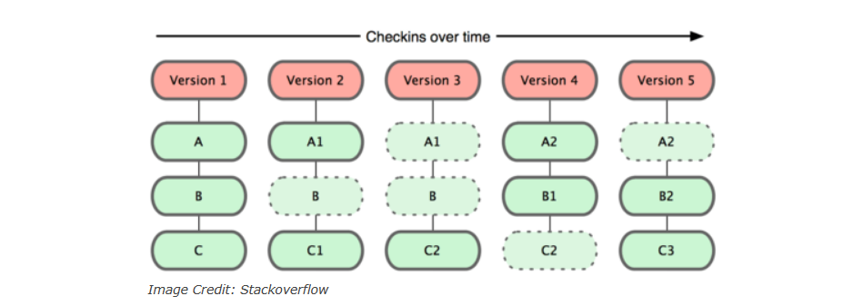
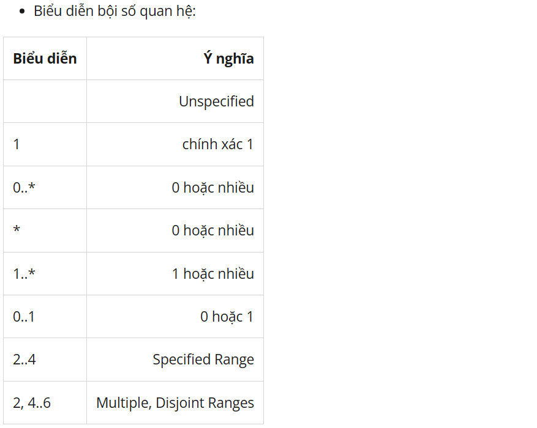
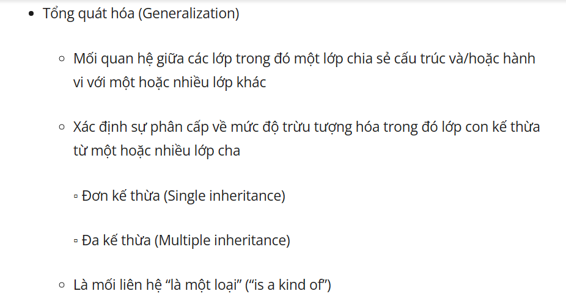
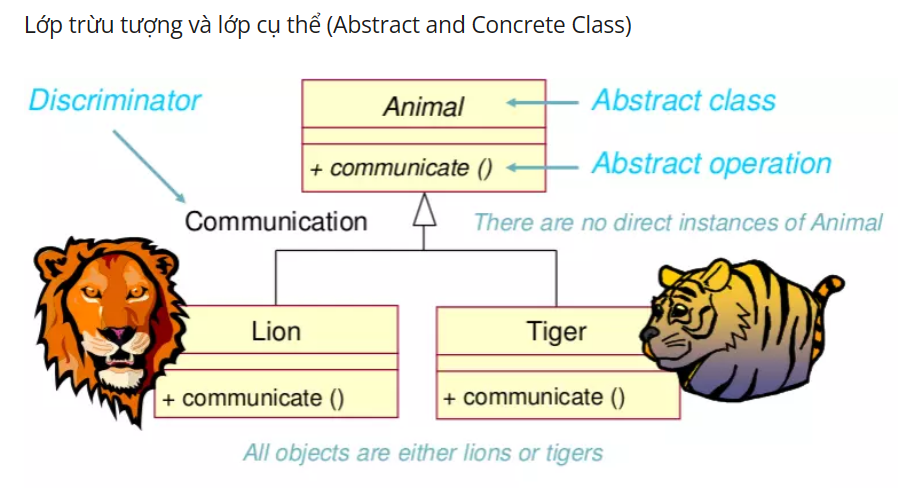

# Buổi 5: DEV THÌ KHÔNG CHỈ VIẾT CODE

## 1. Version Control

- Version Control là một khái niệm trong lập trình, nó có nghĩa là quản lý các phiên bản khác nhau của các tệp tin và chương trình máy tính.
- Một hệ thống quản lý phiên bản, hay VCS, cung cấp hai khả năng quản lý dữ liệu chính. Nó cho phép người dùng
    1) khóa tập tin để họ chỉ có thể được chỉnh sửa bởi một người tại một thời điểm, và những thay đổi
    2) theo dõi các tập tin.
- Version Control cần dùng vì nó mang lại nhiều lợi ích cho các lập trình viên, đặc biệt là khi làm việc nhóm.
    - Lưu trữ lịch sử của các thay đổi, từ đó có thể khôi phục lại các phiên bản trước đó, so sánh các phiên bản, xem ai đã thực hiện thay đổi gì và khi nào.
    - Hỗ trợ cộng tác giữa các lập trình viên, từ đó có thể chia sẻ mã nguồn, đồng bộ hóa các thay đổi, giải quyết các xung đột, phân quyền và quản lý quy trình phát triển.
    - Tăng hiệu quả và chất lượng của sản phẩm, từ đó có thể kiểm tra và sửa lỗi dễ dàng, phát hiện và ngăn chặn các vấn đề tiềm ẩn, đảm bảo tính nhất quán và bảo mật của mã nguồn.
- Có thể tham khảo chi tiết tại: [vnpro.vn](https://vnpro.vn/thu-vien/tim-hieu-ve-version-control-git-cac-cau-lenh-tren-git-bash-va-cach-dua-file-len-github-phan-1-4391.html)

## 2.Các khái niệm về GIT

- `Git` là một hệ thống quản lý phiên bản phân tán (Distributed Version Control System – DVCS)

- Nó là một trong những hệ thống quản lý phiên bản phân tán phổ biến nhất hiện nay. 

- Git cung cấp cho mỗi lập trình viên kho lưu trữ (repository) riêng chứa toàn bộ lịch sử thay đổi.

#### Version Control System – VCS

- VCS là viết tắt của Version Control System là hệ thống kiểm soát các phiên bản phân tán mã nguồn mở. Các VCS sẽ lưu trữ tất cả các file trong toàn bộ dự án và ghi lại toàn bộ lịch sử thay đổi của file. Mỗi sự thay đổi được lưu lại sẽ được và thành một version (phiên bản).

- VCS nghĩa là hệ thống giúp lập trình viên có thể lưu trữ nhiều phiên bản khác nhau của một mã nguồn được nhân bản `clone` từ một kho chứa mã nguồn `repository`, mỗi thay đổi vào mã nguồn trên local sẽ có thể ủy thác `commit` rồi đưa lên server nơi đặt kho chứa chính.

#### VCS có tác dụng như thế nào?

- Lưu lại lịch sử các version của bất kỳ thay đổi nào của dự án. Giúp xem lại các sự thay đổi hoặc khôi phục (revert) lại sau này.

- Việc chia sẻ code trở nên dễ dàng hơn, lập trình viên có thể để public cho bất kỳ ai, hoặc private chỉ cho một số người có thẩm quyền có thể truy cập và lấy code về.

> ***Vốn là một VCS nên Git cũng ghi nhớ lại toàn bộ lịch sử thay đổi của source code trong dự án. Lập trình sửa file, thêm dòng code tại đâu, xóa dòng code ở hàng nào…đều được Git ghi nhận và lưu trữ lại.***

#### Git hoạt động như thế nào?

- Sự khác biệt chính giữa Git và bất kỳ VCS nào khác (bao gồm Subversion…) là cách Git nghĩ về dữ liệu của nó.

- Git coi thông tin được lưu trữ là một tập hợp các snapshot – ảnh chụp toàn bộ nội dung tất cả các file tại thời điểm.

- Mỗi khi bạn “commit”, Git sẽ “chụp” và tạo ra một snapshot cùng một tham chiếu tới snapshot đó. Để hiệu quả, nếu các tệp không thay đổi, Git sẽ không lưu trữ lại file — chỉ là một liên kết đến tệp giống file trước đó mà nó đã lưu trữ. Git nghĩ về dữ liệu của nó giống như dưới đây:

>***Đây là điểm khác biệt quan trọng giữa Git và gần như tất cả các VCS khác. Nó khiến Git phải xem xét lại hầu hết mọi khía cạnh của kiểm soát phiên bản mà hầu hết các hệ thống khác đã sao chép từ thế hệ trước. Điều này làm cho Git giống như một hệ thống tệp nhỏ với một số công cụ cực kỳ mạnh mẽ được xây dựng trên nó, thay vì chỉ đơn giản là một VCS.***

#### Git có lợi ích gì?

- Dễ sử dụng, thao tác nhanh, gọn, lẹ và rất an toàn.
- Sễ dàng kết hợp các phân nhánh (branch), có thể giúp quy trình làm việc code theo nhóm đơn giản hơn rất nhiều.
- Chỉ cần clone mã nguồn từ kho chứa hoặc clone một phiên bản thay đổi nào đó từ kho chứa, hoặc một nhánh nào đó từ kho chứa là bạn có thể làm việc ở mọi lúc mọi nơi.
- Deployment sản phẩm của bạn một cách không thể nào dễ dàng hơn.

#### Các thuật ngữ Git quan trọng

###### 1. Branch
- Các Branch (nhánh) đại diện cho các phiên bản cụ thể của một kho lưu trữ tách ra từ project chính của bạn.
- Branch cho phép bạn theo dõi các thay đổi thử nghiệm bạn thực hiện đối với kho lưu trữ và có thể hoàn nguyên về các phiên bản cũ hơn.
###### 2. Commit
- Một commit đại diện cho một thời điểm cụ thể trong lịch sử dự án của bạn. Sử dụng lệnh commit kết hợp với lệnh ***`git add .`*** để cho git biết những thay đổi bạn muốn lưu vào local repository.
###### 3.Checkout
- Sử dụng lệnh git checkout để chuyển giữa các branch. Chỉ cần nhập ***`git checkout`*** theo sau là tên của branch bạn muốn chuyển đến hoặc nhập git checkout master để trở về branch chính (master branch).
###### 4. Fetch
- Lệnh ***`git fetch`*** tìm nạp các bản sao và tải xuống tất cả các tệp branch vào máy tính của bạn. Sử dụng nó để lưu các thay đổi mới nhất vào kho lưu trữ của bạn. Nó có thể tìm nạp nhiều branch cùng một lúc.
###### 5. Fork
- Một fork là một bản sao của một kho lưu trữ (repository). Các lập trình viên thường tận dụng lợi ích của fork để thử nghiệm các thay đổi mà không ảnh hưởng đến dự án chính.
###### 6. Head
- Các commit ở đầu của một branch được gọi là head. Nó đại diện cho commit mới nhất của repository mà bạn hiện đang làm việc.
###### 7. Index
- Bất cứ khi nào bạn thêm, xóa hoặc thay đổi một file, nó vẫn nằm trong chỉ mục cho đến khi bạn sẵn sàng commit các thay đổi. Nó như là khu vực tổ chức (stagging area) cho Git. Sử dụng lệnh ***`git status`*** để xem nội dung của index của bạn.
###### 8. Master
- Master là nhánh chính của tất cả các repository của bạn. Nó nên bao gồm những thay đổi và commit gần đây nhất.
###### 9. Merge
- Lệnh ***`git merge`*** kết hợp với các yêu cầu kéo (pull requests) để thêm các thay đổi từ nhánh này sang nhánh khác.
###### 10. Origin
- Origin là phiên bản mặc định của repository. Origin cũng đóng vai trò là bí danh hệ thống để liên lạc với nhánh chính.
- Lệnh ***`git push origin master`*** để đẩy các thay đổi cục bộ đến nhánh chính.
###### 11. Pull
- Pull requests thể hiện các đề xuất thay đổi cho nhánh chính. Nếu bạn làm việc với một nhóm, bạn có thể tạo các pull request để yêu cầu người bảo trì kho lưu trữ xem xét các thay đổi và hợp nhất chúng.
- Lệnh ***`git pull`*** được sử dụng để thêm các thay đổi vào nhánh chính.
###### 12. Push
- Lệnh ***`git push`*** được sử dụng để cập nhật các nhánh từ xa với những thay đổi mới nhất mà bạn đã `commit`.
###### 13. Rebase
- Lệnh ***`git rebase`*** cho phép bạn phân tách, di chuyển hoặc thoát khỏi các commit. Nó cũng có thể được sử dụng để kết hợp hai nhánh khác nhau.
###### 14. Remote
- Một Remote (kho lưu trữ từ xa) là một bản sao của một chi nhánh. Remote giao tiếp ngược dòng với nhánh gốc (origin branch) của chúng và các Remote khác trong kho lưu trữ.
###### 15. Repository
- Kho lưu trữ Git chứa tất cả các tệp dự án của bạn bao gồm các branch, tags và commit.
###### 16. Stash
- Lệnh ***`git stash`*** sẽ loại bỏ các thay đổi khỏi chỉ mục của bạn và xóa stashes chúng đi sau.
- Nó có ích nếu bạn muốn tạm dừng những gì bạn đang làm và làm việc khác trong một khoảng thời gian. Bạn không thể đặt stash nhiều hơn một bộ thay đổi ở cùng một thời điểm.
###### 17. Tags
- Tags cung cấp cho bạn một cách để theo dõi các commit quan trọng. Các tags nhẹ chỉ đơn giản đóng vai trò là con trỏ trong khi các tags chú thích được lưu trữ dưới dạng các đối tượng đầy đủ.

#### Cách sử dụng các lệnh của GIT
>Có thể tham khảo ở đây: [topdev.vn](https://topdev.vn/blog/git-la-gi/)

## 3. Pull Request

- Pull Request là một tính năng của hệ thống quản lý mã nguồn (source control management) như Git, GitHub, hay GitLab. Nó là một cách để người dùng có thể đề xuất thay đổi vào mã nguồn của một dự án đã được lưu trữ trên hệ thống quản lý mã nguồn đó.

- Khi một người dùng muốn đóng góp vào một dự án, họ có thể tạo một branch (nhánh) riêng từ branch chính (thường là branch master), thực hiện các thay đổi cần thiết trong branch này, rồi đưa các thay đổi lên remote repository và tạo một pull request.
- Pull request bao gồm các thông tin về các thay đổi đã thực hiện, các commit mới, các nhận xét, v.v. Người sở hữu dự án hoặc các thành viên khác của dự án có thể xem và kiểm tra các thay đổi trước khi chấp nhận hoặc từ chối pull request.
- Khi một pull request được chấp nhận, các thay đổi được hợp nhất vào branch chính của dự án. Quá trình này có thể được tự động hóa bằng các công cụ tích hợp liên kết với hệ thống quản lý mã nguồn. Pull request là một cách linh hoạt và an toàn để đóng góp vào dự án và đảm bảo rằng các thay đổi mới không gây ra tác động tiêu cực đến mã nguồn hiện có.

#### Tại sao Pull Request lại quan trọng
- **Đảm bảo chất lượng mã nguồn:** Pull Request giúp đảm bảo rằng tất cả các thay đổi trên mã nguồn đã được xem xét và kiểm tra kỹ lưỡng trước khi hợp nhất vào branch chính. Nhờ đó, giúp tránh được các lỗi và xung đột trong quá trình phát triển.
- **Giúp đơn giản hóa quy trình kiểm tra code:** Pull Request cho phép người tham gia dự án có thể đóng góp thay đổi vào mã nguồn một cách dễ dàng. Nó cũng giúp đơn giản hóa quy trình kiểm tra và chấp nhận các thay đổi.
- **Tăng tính minh bạch và sự tham gia của cộng đồng:** Pull Request cho phép cộng đồng tham gia vào quá trình phát triển, giúp tăng sự minh bạch và động lực cho các thành viên khác trong dự án.
- **Đóng góp vào phát triển dự án:** Pull Request cho phép các nhà phát triển đóng góp ý tưởng mới và thay đổi vào dự án một cách dễ dàng. Nhờ đó, dự án sẽ phát triển một cách nhanh chóng và có tính đột phá hơn.
>***Tóm lại, Pull Request là một công cụ mạnh mẽ cho phép các nhà phát triển và cộng đồng đóng góp và phát triển mã nguồn của một dự án một cách chính xác và hiệu quả.***

#### Các bước tạo 1 Pull Request

1. Tạo một branch mới: Trước khi bắt đầu chỉnh sửa mã nguồn, bạn nên tạo một branch mới để làm việc trên đó. Điều này đảm bảo rằng các thay đổi của bạn không ảnh hưởng đến mã nguồn chính của dự án.
2. Chỉnh sửa mã nguồn: Tiếp theo, bạn sẽ chỉnh sửa mã nguồn trên branch mới của mình. Bạn có thể thêm, sửa đổi hoặc xóa bất kỳ file nào tùy ý, tùy theo mục đích của bạn.
3. Commit thay đổi: Sau khi bạn hoàn thành chỉnh sửa mã nguồn, bạn sẽ phải commit các thay đổi của mình vào branch mới của mình. Mỗi commit sẽ đại diện cho một bản sao của mã nguồn với các thay đổi mới của bạn.
4. Tạo Pull Request: Khi các thay đổi của bạn đã được commit vào branch mới, bạn có thể tạo Pull Request để gộp các thay đổi của mình vào nhánh chính của dự án. Trong quá trình tạo Pull Request, bạn sẽ cung cấp thông tin về các thay đổi của mình và mô tả về mục đích của các thay đổi đó.
5. Xem xét và thảo luận: Các nhà phát triển khác có thể xem và xem xét các thay đổi của bạn trong Pull Request. Họ có thể đưa ra các ý kiến, đề xuất sửa đổi hoặc chỉnh sửa thêm để tăng tính ổn định và hiệu quả của mã nguồn.
6. Merge Pull Request: Cuối cùng, sau khi các thay đổi đã được xem xét và chấp nhận, bạn có thể merge Pull Request vào nhánh chính của dự án. Khi Pull Request được merge, các thay đổi của bạn sẽ được áp dụng vào nhánh chính và được phát hành trong phiên bản tiếp theo của dự án.

## 4. UML

- **Ngôn ngữ mô hình hóa thống nhất (tiếng Anh: Unified Modeling Language, viết tắt thành UML)** là một ngôn ngữ mô hình gồm các ký hiệu đồ họa mà các phương pháp hướng đối tượng sử dụng để thiết kế các hệ thống thông tin một cách nhanh chóng.
- Cách tiếp cận theo mô hình của UML giúp ích rất nhiều cho những người thiết kế và thực hiện hệ thống thông tin cũng như những người sử dụng nó
- Tạo nên một cái nhìn bao quát và đầy đủ về hệ thống thông tin dự định xây dựng. Cách nhìn bao quát này giúp nắm bắt trọn vẹn các yêu cầu của người dùng; phục vụ từ giai đoạn phân tích đến việc thiết kế, thẩm định và kiểm tra sản phẩm ứng dụng công nghệ thông tin.
- Các mô hình hướng đối tượng được lập cũng là cơ sở cho việc ứng dụng các chương trình tự động sinh mã trong các ngôn ngữ lập trình hướng đối tượng, chẳng hạn như ngôn ngữ C++, Java,...
-  Các mô hình được sử dụng bao gồm Mô hình đối tượng (mô hình tĩnh) và Mô hình động.
-  UML sử dụng một hệ thống ký hiệu thống nhất biểu diễn các Phần tử mô hình (model elements). Tập hợp các phần tử mô hình tạo thành các Sơ đồ UML (UML diagrams). Có các loại sơ đồ UML chủ yếu sau:
   -  Sơ đồ lớp (Class Diagram)
   -  Sơ đồ hoạt động (Activity Diagram)
   -  ...

#### Biểu đồ lớp (Class Diagram)

- Một biểu đồ lớp chỉ ra cấu trúc tĩnh của các lớp trong hệ thống. Các lớp là đại diện cho các “đối tượng” được xử lý trong hệ thống. Các lớp có thể quan hệ với nhau trong nhiều dạng thức:
  - **liên kết** (associated - được nối kết với nhau)
  - **phụ thuộc** (dependent - một lớp này phụ thuộc vào lớp khác)
  - **chuyên biệt hóa** (specialized - một lớp này là một kết quả chuyên biệt hóa của lớp khác)
  - **đóng gói** ( packaged - hợp với nhau thành một đơn vị)

###### Một lớp có các thành phần sau
- Tên lớp
- Các thuộc tính
- Các phương thức
###### Liên kết giữa các lớp
- **Liên kết** (Association):
  - Mối liên hệ ngữ nghĩa giữa hai hay nhiều lớp chỉ ra sự liên kết giữa các thể hiện của chúng
  - Mối quan hệ về mặt cấu trúc chỉ ra các đối tượng của lớp này có kết nối với các đối tượng của lớp khác.
- **Bội số quan hệ:** là số lượng thể hiện của một lớp liên quan tới một thể hiện của lớp khác. Với mỗi liên kết, có hai bội số quan hệ cho hai đầu của liên kết.
- Với mỗi đối tượng của Professor, có nhiều Course Offerings có thể được dạy. Với mỗi đối tượng của Course Offering, có thể có 1 hoặc 0 Professor giảng dạy.

- **Kết tập** (Aggregation):
  - Là một dạng đặc biệt của liên kết mô hình hóa mối quan hệ toàn thể-bộ phận (whole-part) giữa đối tượng toàn thể và các bộ phận của nó.
  - Kết tập là mối quan hệ “là một phần” (“is a part-of”).
  - Bội số quan hệ được biểu diễn giống như các liên kết khác
  - **Cấu thành** (Composition) là : Một dạng của kết tập với quyền sở hữu mạnh và các vòng đời trùng khớp giữa hai lớp
  - Whole sở hữu Part, tạo và hủy Part.
  - Part bị bỏ đi khi Whole bị bỏ, Part không thể tồn tại nếu Whole không tồn tại.

###### Gói
- Nếu bạn đang mô hình hóa một hệ thống lớn hoặc một lĩnh vực nghiệp vụ lớn, thì không thể tránh khỏi, sẽ có nhiều phân loại khác nhau trong mô hình của bạn.
- Việc quản lý tất cả các lớp có thể là một nhiệm vụ khó khăn, do vậy UML cung cấp một phần tử tổ chức được gọi là gói.
- Các gói cho phép các nhà tạo mô hình tổ chức các phân loại của mô hình thành các vùng tên, là một kiểu giống như các thư mục trong một hệ thống tệp.
- Có hai cách để vẽ các gói trên sơ đồ.

#### Activity Diagram: Bản vẽ hoạt động
Có thể tham khảo thêm tại: [iviettech.vn](https://iviettech.vn/blog/1066-activity-diagram-ban-ve-hoat-dong.html)

