# MỘT SỐ CẤU TRÚC DỮ LIỆU THƯỜNG THẤY TRONG JAVA

## 1. Cấu trúc dữ liệu để là gì? Sử dụng như thế nào?

**Cấu trúc dữ liệu** là một hình thức tổ chức, lưu trữ dữ liệu theo hệ thống và thứ tự để có thể sử dụng tài liệu một cách tối ưu. Có rất nhiều cách để lưu trữ dữ liệu trong bộ nhớ, nhưng khi làm việc thì chúng ta sẽ thấy mảng trong ngôn ngữ C/C++ được sử dụng nhiều nhất.

**Cấu trúc dữ liệu** là tập hợp các thuật toán mà chúng ta có thể để nó trong bộ nhớ và sử dụng với bất kì ngôn ngữ lập trình nào. Tất nhiên là chúng không phải là 1 ngôn ngữ phần mềm.

#### Các hoạt động phổ biến trên cấu trúc dữ liệu
**Tìm kiếm**: tìm kiếm tất cả các phần tử
**Sắp xếp**: thực hiện sắp xếp các phần tử theo thứ tự tăng / giảm dần (tùy sự biến đổi có thể sắp xếp tùy ý theo chủ thể)
**Chèn**: chèn các phần tử mới
**Cập nhật**: Chúng ta có thể thay thế hoặc cập nhật một phần tử nào đó trong CTDL = 1 phần tử khác.
**Xóa**: loại bỏ phần tử

#### Các loại CTDL

- Một số cấu trúc cơ bản như: Float, Integer, Boolean, Char,... Ngoài ra, chúng còn được dùng với cái tên là kiểu dữ liệu nguyên thủy.
- Bên cạnh đó còn có các CTDL phức tạp hơn, có thể kể đến:
  - **Lists**: theo dạng danh sách
  - **Graps**: đồ thị
  - **Trees**: dạng cây
  - **Stacks**: dạng ngăn xếp
  - ...
>**Tùy vào mục đích sử dụng, chúng ta sẽ lựa chọn sử dụng và tư duy cách chọn CTDL phù hợp.** 

#### Phân loại các CTDL

###### Theo đặc tính
- **Tuyến tính**: Các dữ liệu sẽ được sắp xếp theo dạng tuần tự (Mảng)
- **Không tuyến tính**: Các dữ liệu sẽ được sắp xếp không theo dạng tuần tự (Cây - Đồ thị).
- **Đồng nhất**: Các dữ liệu được đồng nhất (Mảng).
- **Không đồng nhất**: Các dữ liệu không đồng nhất (Cấu trúc).
- **Động**: Các dữ liệu động có thể thay đổi tùy mục đích sử dụng (List).
- **Tĩnh**: bộ nhớ được mặc định sẵn (Mảng).
#### Cách thức cấu trúc dữ liệu được sử dụng
- Lưu trữ dữ liệu
- Quản lí tài nguyên và dịch vụ
- Trao đổi dữ liệu
- Đặt hàng và phân loại
- Lập chỉ mục
- Tìm kiếm
- Khả năng mở rộng

## 2. List - Set - Queue

#### 2.1 List
**List** là một interface trong java. Nó chứa các phương thức để chèn và xóa các phần tử dựa trên chỉ số index.
**Ví dụ:**
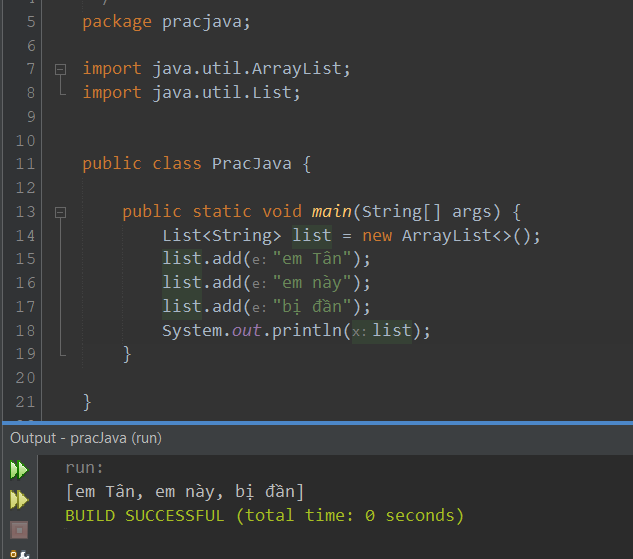

**Các phương thức của Interface List**
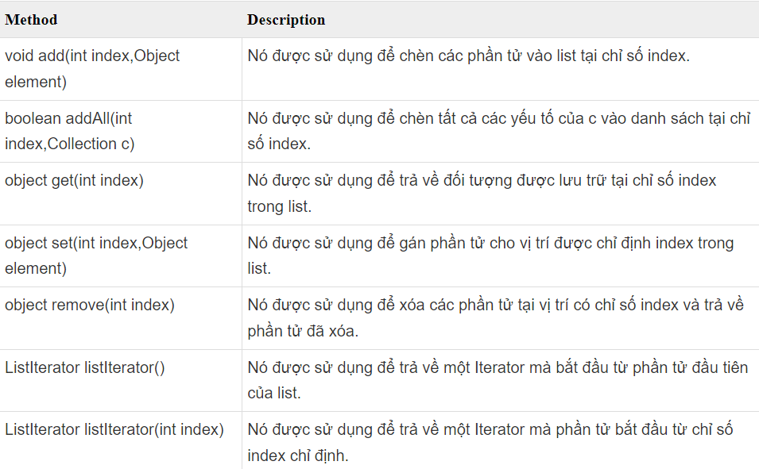

**Các Interface List hay sử dụng**
- ArrayList
- LinkedList
> **Sự khác nhau giữa 2 List**
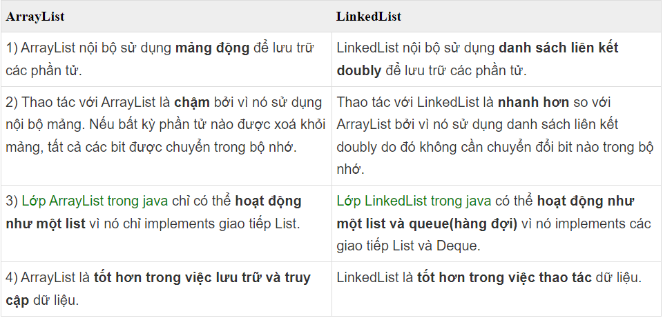

**Tại sao lại sinh ra 2 loại List ?**
###### ArrayList
- Thông thường, ArrayList là lựa chọn mặc định cho nhiều nhà phát triển khi họ cần List implementation. Thực tế thì nó sẽ là một lựa chọn tốt khi các hoạt động đọc dữ liệu diễn ra nhiều hơn số lần ghi.
- Đôi khi chúng ta cần đọc và ghi thường xuyên như nhau. Nếu chúng ta có ước tính về số lượng phần tử tối đa có thể, thì việc sử dụng ArrayList vẫn có ý nghĩa. Nếu đúng như vậy, chúng ta có thể khởi tạo ArrayList với dung lượng ban đầu.
- Việc này sẽ giúp chúng ta giảm thiểu tối đa việc phải phân bổ lại array khi kích thước của nó không còn đủ để lưu trữ.

- Ngoài ra, array được đánh chỉ mục với giá trị kiểu int trong Java, vì vậy số lượng phần tử tối đa được lưu trữ bên trong ArrayList không vượt quá 2^32.
###### LinkedList
- LinkedList phù hợp hơn ArrayList khi các hoạt động thêm phần tử xảy ra thường xuyên hơn là đọc. Ngoài ra, nó có thể được sử dụng trong các trường hợp việc đọc dữ liệu đa số là đọc phần tử đầu tiên và cuối cùng.

#### 2.2 Set

**Set** là một interface kế thừa Collection interface trong java. Set trong java là một Collection không thể chứa các phần tử trùng lặp.

**Set** được triển khai bởi Hashset, LinkedHashset, Treeset hoặc EnumSet. Có thể dùng do người tự tạo (setter).

- **HashSet** lưu trữ các phần tử của nó trong bảng băm, là cách thực hiện tốt nhất, tuy nhiên nó không đảm bảo về thứ tự các phần tử được chèn vào.
- **TreeSet** lưu trữ các phần tử của nó trong một cây, sắp xếp các phần tử của nó dựa trên các giá trị của chúng, về cơ bản là chậm hơn HashSet.
- **LinkedHashSet** được triển khai dưới dạng bảng băm với có cấu trúc dữ liệu danh sách liên kết, sắp xếp các phần tử của nó dựa trên thứ tự chúng được chèn vào tập hợp (thứ tự chèn).
- **EnumSet** là một cài đặt chuyên biệt để sử dụng với các kiểu enum.

**Các phương thức trong Set**
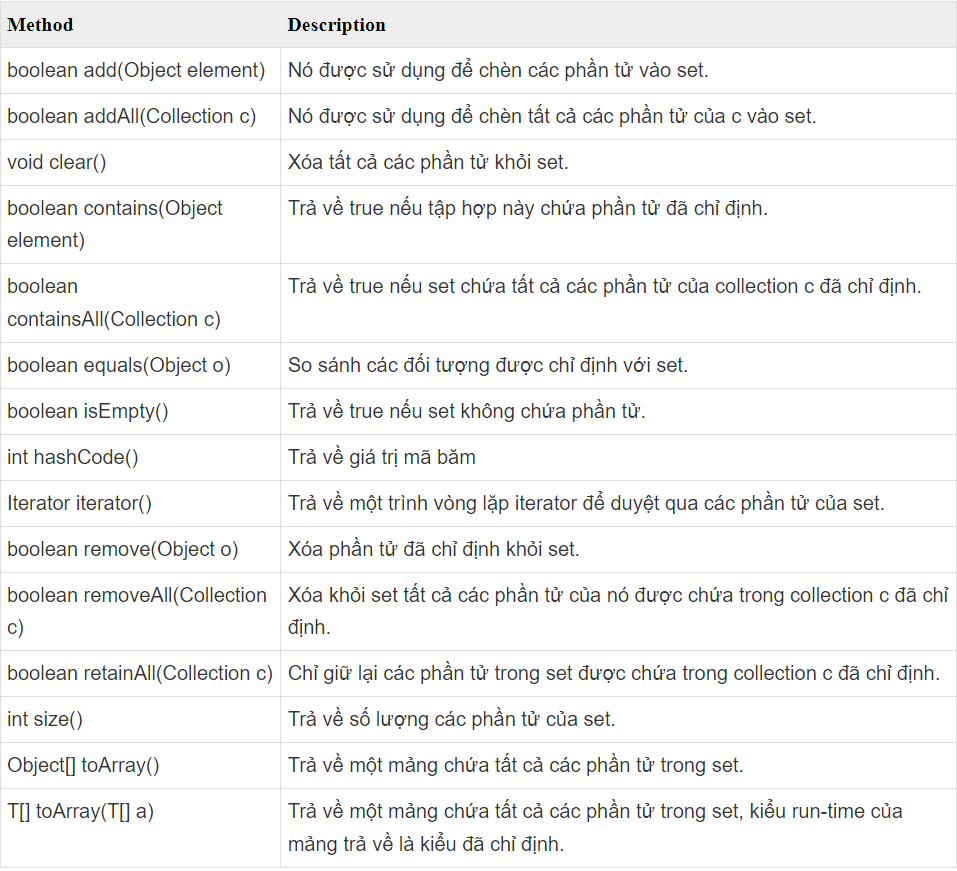

**Khai báo Set**
Vì Set là 1 interface => khởi tạo phải dùng 1 trong 4 cách triển khai trên:
```java
Set setA = new HashSet<>(); // chủ yếu sẽ dùng cái này
Set setB = new TreeSet<>(); // ít gặp
Set setC = new LinkedHashSet<>(); // ít gặp
Set setD = new EnumSet<>();// chưa hiểu cách dùng Enum lắm
```

**Bộ lặp Iterator**
**Ví dụ:**
```java
Set<String> setA = new HashSet<>();
setA.add("Java");
setA.add("Python");
setA.add("Java");
setA.add("PHP");
System.out.println("Số phần tử của setA: " + setA.size());
System.out.println("Các phần tử của setA: ");
Iterator<String> iterator = setA.iterator();
while (iterator.hasNext()) {
    System.out.println(iterator.next());
}
```

**Output**
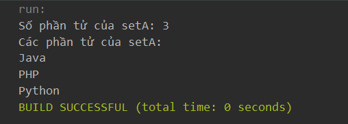

###### HashSet trong Java
- Lớp HashSet trong java là một lớp kế thừa lớp AbstractSet và triển khai của Set Interface trong Collections Framework nên nó sẽ có một vài đặc điểm và phương thức tương đồng với Set. HashSet được sử dụng để tạo một bộ sưu tập sử dụng bảng băm để lưu trữ. Nó kế thừa lớp AbstractSet và triển khai Set interface.
- Đặc điểm:
  - HashSet chỉ chứa các phần tử duy nhất
  - HashSet lưu trữ các phần tử theo cơ chế được gọi là **băm**

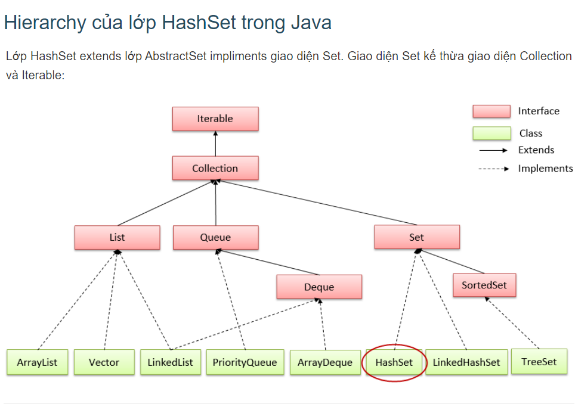

**Constructor trong HashSet**

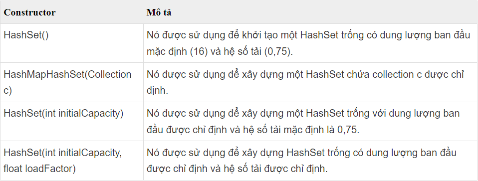

#### 2.3 Queue

- Là 1 cách sử dụng của LinkedList, dùng các phương thức khác nhau. Bao gồm: 
  - Thêm phần tử: offer();
  - Xóa phần tử: pull();
  - Lấy phần tử ở đầu queue: peek();
- Cơ chế: FIFO
Ví dụ:
```java
public class QueueExample {
    public static void main(String[] args) {
        Queue<String> queue = new LinkedList<>();
 
        // add elements to the queue
        queue.add("apple");
        queue.add("banana");
        queue.add("cherry");
 
        // print the queue
        System.out.println("Queue: " + queue);
 
        // remove the element at the front of the queue
        String front = queue.remove();
        System.out.println("Removed element: " + front);
 
        // print the updated queue
        System.out.println("Queue after removal: " + queue);
 
        // add another element to the queue
        queue.add("date");
 
        // peek at the element at the front of the queue
        String peeked = queue.peek();
        System.out.println("Peeked element: " + peeked);
 
        // print the updated queue
        System.out.println("Queue after peek: " + queue);
    }
}
```
## 3. HashMap
- Lớp HashMap trong java là một lớp kế thừa lớp AbstractMap và triển khai của Map Interface trong Collections Framework nên nó sẽ có một vài đặc điểm và phương thức tương đồng với Map. 
- HashMap được sử dụng để lưu trữ các phần tử dưới dạng **"key/value"**. Key và value là kiểu dữ liệu bất kỳ, và bạn có thể truy cập các giá trị của HasMap bằng một key cụ thể.
- Những điểm quan trọng: 
  - HashMap lưu trữ dưới dạng key - value
  - Chứa key duy nhất (giống C++)
  - 1 key là null và có nhiều value là null
  - Duy trì các phần tử không theo tuần tự thêm vào.

#### Khai báo
```java
HashMap<String, Integer> map = new HashMap<>();
```

#### Constructor trong HashMap
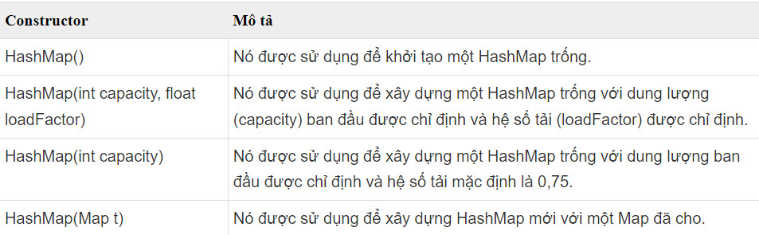
#### Phương thức trong HashMap
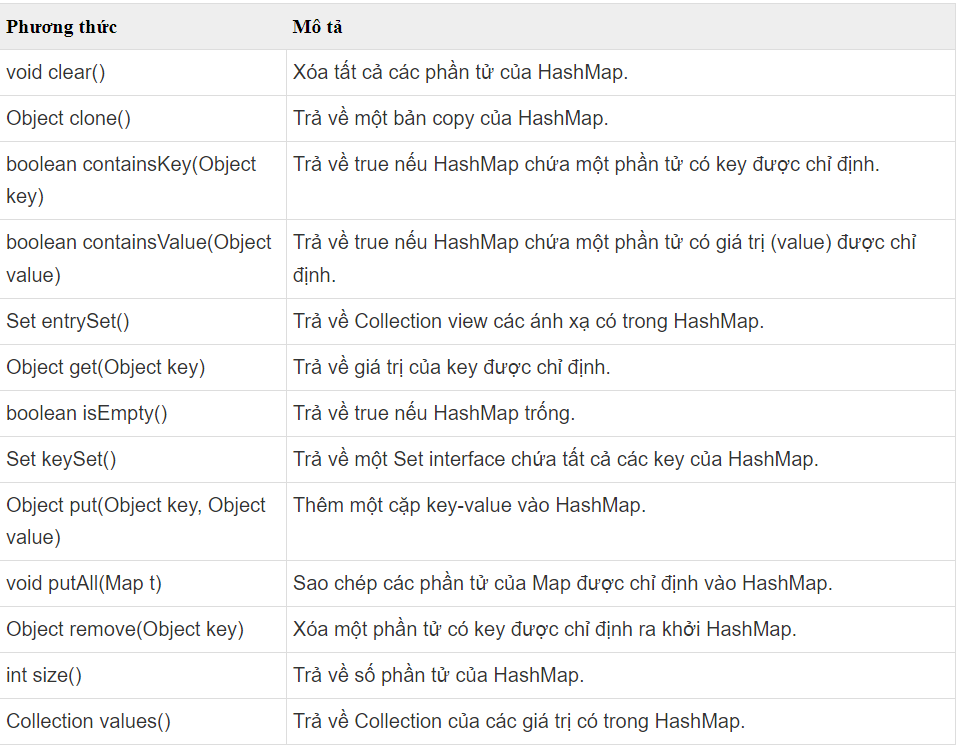
#### Cách sử dụng

**Hiển thị**
```java
import java.util.HashMap;
 
public class HashMapExample1 {
    public static void main(String args[]) {
        // khoi tao hashMap
        HashMap<Integer, String> hashMap = new HashMap<>();
        // them cac phan tu vao hashMap
        hashMap.put(1, "Java");
        hashMap.put(3, "C++");
        hashMap.put(2, "PHP");
        hashMap.put(4, "Python");
        // hien thi HashMap
        System.out.println(hashMap);
    }
}
```

**Sử dụng Map.Entry interface để duyệt các phần tử trong HashMap**
```java
public class HashMapExample7 {
    public static void main(String args[]) {
        // init map
        HashMap<Integer, String> map = new HashMap<Integer, String>();
        // add elements to map
        map.put(1, "Java");
        map.put(3, "C++");
        map.put(2, "PHP");
        map.put(4, "Python");
        // show map
        for (Map.Entry<Integer, String> entry : map.entrySet()) {
            System.out.println(entry.getKey() + " - " + entry.getValue());
        }
    }
}
```

## 4. TreeMap
- Lớp TreeMap trong java là một lớp kế thừa lớp AbstractMap và triển khai của NavigableMap Interface (NavigableMap kế thừa SortedMap, SortedMap kế thừa Map interface). trong Collections Framework nên nó sẽ có một vài đặc điểm và phương thức tương đồng với Map và SortedMap và NavigableMap. TreeMap được sử dụng để lưu trữ các phần tử dưới dạng **"key/value"**. 
- Key và value là kiểu dữ liệu bất kỳ, và bạn có thể truy cập các giá trị của HasMap bằng một key cụ thể.
- Đặc điểm:
  - Lưu trữ dưới dạng key - value
  - Chứa key duy nhất
  - Không có key = null nhưng có thể có nhiều value là null
  - Duy trì phần tử theo thứ tự key tăng dần.

**? Sự khác biệt giữa HashMap và TreeMap**

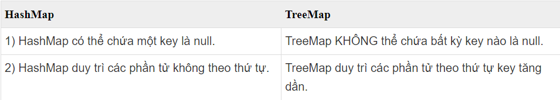

**Constructor của TreeMap**
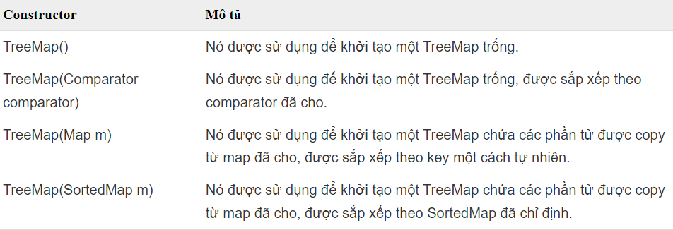

**Các phương thức của TreeMap và cách sử dụng** 
return HashMap;

## 5. Sort
```java
class GFG {
    public static void main(String args[])
    {
        int[] arr = { 5, -2, 23, 7, 87, -42, 509 };
        System.out.println("The original array is: ");
        for (int num : arr) {
            System.out.print(num + " ");
        }
        Arrays.sort(arr);
        System.out.println("\nThe sorted array is: ");
        for (int num : arr) {
            System.out.print(num + " ");
        }
    }
}
```
**Output**
```java
The original array is: 
5 -2 23 7 87 -42 509 
The sorted array is: 
-42 -2 5 7 23 87 509 
```
-------------------------------------------------------------------------------