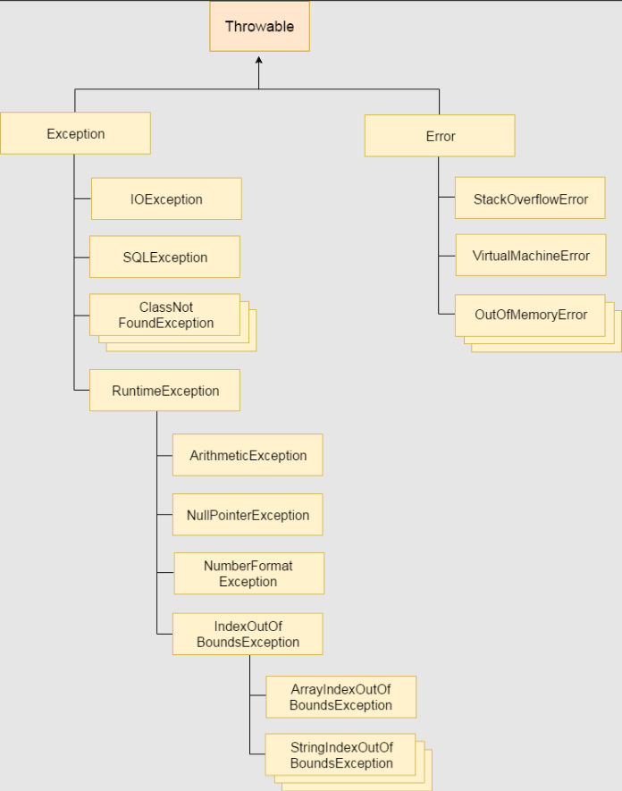
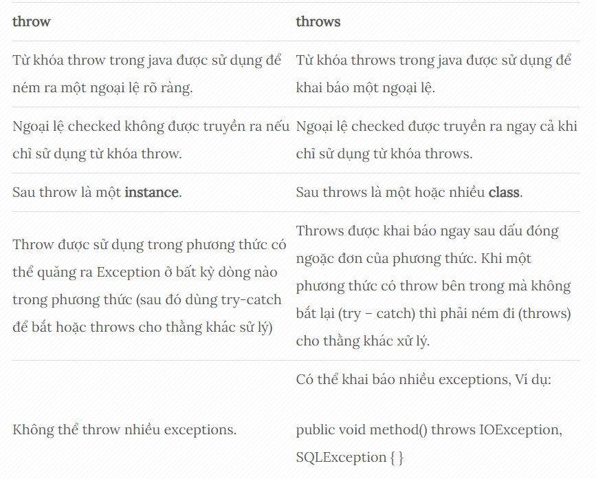

# LUÔN CÓ NGOẠI LỆ, XỬ LÍ NGOẠI LỆ

## EXCEPTION
 - Exception: một tình trạng bất thường
 - Trong Java, Exception là 1 sự kiện mà phá vỡ luồng chuẩn của chương trình.
 - Một Exception (ngoại lệ) trong Java là 1 vấn đề xảy ra với chương trình vì 1 số lí do sau:
   - Người dùng nhập dữ liệu không hợp lệ.
   - Một file cần được mở nhưng không thể tìm thấy.
   - Kết nối mạng bị ngắt trong quá trình thực hiện giao tiếp hoặc JVM hết bộ nhớ.

#### EXCEPTION HANDLING
- Exception Handling (xử lý ngoại lệ) là một cơ chế xử lý các lỗi runtime như ClassNotFound, IO, SQL, Remote, vv.
>**Lợi thế cốt lõi của việc xử lý ngoại lệ là duy trì luồng bình thường của ứng dụng. Ngoại lệ thường làm gián đoạn luồng bình thường của ứng dụng đó là lý do tại sao chúng ta sử dụng xử lý ngoại lệ.**

###### Cấp bậc Exception

#### Các loại Exception
**Note**:
>**run time**: là thời điểm chương trình đang chạy
>**compile time**: là thời điểm source code đang được compile

Thông thường run time và compile time được nhắc tới khi nói tới lỗi:
  - **runtime** tức là lỗi khi chạy mới thấy, tức lỗi logic.
  -  **compiletime** là lỗi compile là thấy ngay, tức là lỗi cú pháp.
###### 1. Checked Exception
- Là ngoại lệ thường xảy ra do người dùng mà không thể lường trước được bởi lập trình viên. VD: một file được mở, nhưng file đó không thể tìm thấy và ngoại lệ xảy ra.
- Checked Exception là các lớp mà kế thừa lớp Throwable ngoại trừ RuntimeException và Error. Ví dụ như IOException, SQLException, … 
- Checked Exception được kiểm tra tại thời gian biên dịch compile-time.
###### 2. Unchecked Exception
- Một ngoại lệ xảy ra ở runtime là ngoại lệ có thể tránh được bởi lập trình viên.
- Unchecked Exception là các lớp kế thừa RuntimeException, ví dụ ArithmaticException, NullPointerException, ArrayIndexOutOfBoundsException, …
- Unchecked Exception không được kiểm tra tại compile-time, thay vào đó chúng được kiểm tra tại runtime.
###### 3. Error
- Nó không giống các exception, nhưng vấn đề xảy ra vượt quá tầm kiểm soát của lập trình viên hay người dùng.
- Error được bỏ qua trong code của bạn vì bạn hiếm khi có thể làm gì đó khi chương trình bị error. Ví dụ như OutOfMemoryError, VirtualMachineError, AssertionError, … Nó được bỏ qua trong quá trình Java biên dịch.
###### 4. Các phương thức Exception trong Java
- Lớp Exception có hai lớp con chính là : IOException và RuntimeException.
- Dưới đây là danh sách các phương thức phố biến của lớp Throwable trong Java:
  - public String getMessage(): Trả về một message cụ thể về exception đã xảy ra. Message này được khởi tạo bởi phương thức constructor của Throwable.
  - public Throwable getCause(): Trả về nguyên nhân xảy ra exception biểu diễn bởi đối tượng Throwable
  - public String toString(): Trả về tên của lớp và kết hợp với kết quả từ phương thức getMessage().
  - public void printStackTrace(): In ra kết quả của phương thức toString cùng với stack trace đến System.err.
#### Các từ khóa xử lí ngoại lệ

###### 1. try...catch
- Chúng ta đặt khối lệnh có thể gây ra ngoại lệ bên trong khối `try`. Bây giờ nếu một ngoại lệ xảy ra, chương trình sẽ ngay lập tức chuyển sang khối `catch`. Tuy nhiên, nếu ngoại lệ không xảy ra, khối `catch` sẽ bị bỏ qua.
- Ví dụ:
```java
public class PracJava {
    public static void main(String[] args) {
        Scanner sc = new Scanner(System.in);
        try {
            System.out.print("Nhập số chia: ");
            int divisor = Integer.parseInt(sc.nextLine());
            System.out.print("Nhập số bị chia: ");
            int thedividend = Integer.parseInt(sc.nextLine());
            
            int result = divisor/thedividend;
            System.out.println("Kết quả: " + result);
        } catch (Exception e) {
            System.out.println("Số bị chia không thể bằng 0. Hãy thử lại!");
        }
        
    }
}
```
Ở đây, ngoại lệ xảy ra nếu số bị chia là 0. Hãy xem chương trình này hoạt động như thế nào đối với các giá trị khác nhau của số bị chia.
- Nếu mà số bị chia != 0 thì sẽ thực hiện lệnh trong `try`
- Nếu mà số bị chia = 0 thì lệnh in kết quả của `try` sẽ nhảy xuống `catch`
- Đây là 1 ví dụ về ArithmeticException.

Ngoài ra, chúng ta có thể in `e` thay vì in ra 1 dòng báo để đưa ra trực tiếp lỗi.
###### 2. finally
Câu lệnh `try` có thể chứa khối `finally`tùy chọn được thực thi bất kể ngoại lệ xảy ra hay không.
**Ví dụ:**
```java
public class PracJava {
    public static void main(String[] args) {
        Scanner sc = new Scanner(System.in);
        try {
            System.out.print("Nhập số chia: ");
            int divisor = Integer.parseInt(sc.nextLine());
            System.out.print("Nhập số bị chia: ");
            int thedividend = Integer.parseInt(sc.nextLine());
            
            int result = divisor/thedividend;
            System.out.println("Kết quả: " + result);
        } catch (Exception e) {
            System.out.println(e);
        }
        
        finally {
            System.out.println("Hoàn thành phép chia rồi nè!");
        }
        
    }
}
```

Cách chương trình hoạt động:
- Câu lệnh bên trong khối try đưa ra một ngoại lệ.
- Do đó, khối catch được thực thi.
- Sau đó, khối finally được thực thi.

Nếu khối `try` không đưa ra bất kỳ ngoại lệ nào thì khối `catch` sẽ bị bỏ qua. Tuy nhiên, khối `finally` vẫn được thực thi. Khối `finally` được sử dụng để thực hiện các thao tác dọn dẹp cần được thực thi trong mọi trường hợp.

###### 3. Throw
- Từ khoá `throw` trong java được sử dụng để ném ra một ngoại lệ (exception) cụ thể.
- Chúng ta có thể ném một trong hai ngoại lệ `checked` hoặc `unchecked` trong java bằng từ khóa `throw`. Từ khóa `throw` chủ yếu được sử dụng để ném ngoại lệ tùy chỉnh (ngoại lệ do người dùng tự định nghĩa).
- Cú pháp:
```java
throw exception;
```
Ví dụ:
```java
public class PracJava {

    static void checkAge(int age) {
        if (age < 18) {
            throw new ArithmeticException("Chưa đủ tuổi đăng kí kết hôn!");
        } else {
            System.out.println("Cưới thôi em!");
        }
    }

    public static void main(String[] args) {
        checkAge(19);
        System.out.println("Hoàn thành kiểm tra rồi nè!");
    }
}
```
###### 4. Throws
- Từ khóa throws trong java được sử dụng để khai báo một ngoại lệ. Nó thể hiện thông tin cho lập trình viên rằng có thể xảy ra một ngoại lệ, vì vậy nó là tốt hơn cho các lập trình viên để cung cấp các mã xử lý ngoại lệ để duy trì luồng bình thường của chương trình.
- Exception Handling chủ yếu được sử dụng để xử lý ngoại lệ checked. Nếu xảy ra bất kỳ ngoại lệ unchecked như NullPointerException, đó là lỗi của lập trình viên mà anh ta không thực hiện kiểm tra trước khi code được sử dụng.
- Cú pháp:
```java
return_type method_name() throws exception_class_name {
// method code
}
```
- Chỉ ngoại lệ checked nên được khai báo vì: 
  - `Ngoại lệ unchecked` nằm trong sự kiểm soát của bạn (lỗi logic)
  - `error` thì nằm ngoài sự kiểm soát (ví dụ bạn sẽ không thể làm được bất kì điều gì khi các lỗi `VirtualMachineError` hoặc `StackOverflowError` xảy ra.)

- Lợi ích: Ngoại lệ checked có thể được ném ra ngoài và được xử lý ở một hàm khác và cung cấp thông tin cho caller của phương thức về các ngoại lệ.

Ví dụ ngoại lệ xảy ra: 
```java
public class ThrowsExample {
 
    void method() throws IOException {
        throw new IOException("device error");
    }
 
    public static void main(String args[]) throws IOException {
        ThrowsExample obj = new ThrowsExample();
        obj.method();
        System.out.println("normal flow...");
    }
 
}
```
Ví dụ ngoại lệ không xảy ra:
```java
public class ThrowsExample {
 
    void method() throws IOException {
        System.out.println("device operation performed");  
    }
 
    public static void main(String args[]) throws IOException {
        ThrowsExample obj = new ThrowsExample();
        obj.method();
        System.out.println("normal flow...");
    }
 
}
```
###### 5. Sự khác nhau giữa throw và throws



