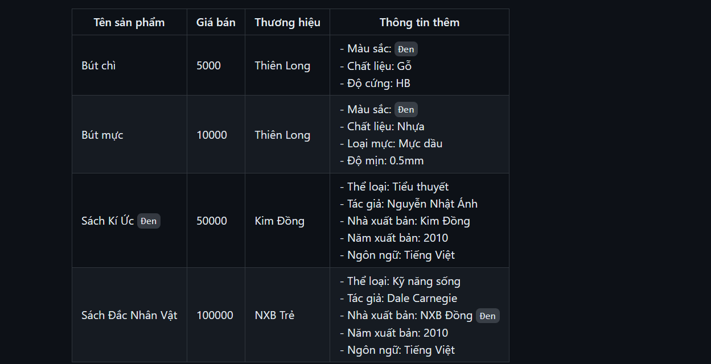

## Đề bài

- Nhờ phần mềm tìm kiếm sách của mình, cửa hàng của Cường ngày càng đông khách hơn. Là một nhà kinh doanh đại tài, Cường muốn kinh doanh nhiều sản phẩm hơn để góp phần thu lãi.
- Cụ thể, anh ấy dự định kinh doanh bán thêm 3 sản phẩm mới, đó là vở ghi, bút chì và bút mực. Cụ thể chúng có các thông tin sau:
    + Vở ghi: Tên sản phẩm, giá bán, thương hiệu, số trang, loại vở (vở kẻ ô, vở kẻ ngang, vở kẻ caro), màu sắc bìa, chất liệu giấy (giấy trắng, giấy màu), kích thước (A4, A5, A6).
    + Bút chì: Tên sản phẩm, giá bán, thương hiệu, màu sắc, chất liệu (gỗ, nhựa), độ cứng (HB, 2B, 3B, 4B, 5B, 6B, 7B, 8B, 9B, 10B).
    + Bút mực: Tên sản phẩm, giá bán, thương hiệu, màu sắc, chất liệu (nhựa, kim loại), loại mực (mực dầu, mực nước), độ mịn (0.5mm, 0.7mm, 1mm, 1.5mm, 2mm, 2.5mm, 3mm, 3.5mm, 4mm, 4.5mm, 5mm).
    + Sách: Tên sản phẩm, giá bán, thể loại, tác giả, nhà xuất bản, năm xuất bản, ngôn ngữ.
- Có đầy đủ chức năng của admin - guest bài 3
- Chức năng tìm kiếm sửa thành in được 2 dạng bảng hoặc danh sách, mỗi 1 truy vẫn sẽ có dạng như sau:
    + Chọn chức năng tìm kiếm
    + Gõ tìm kiếm `đen`
    + Hệ thống hỏi muốn hiển thị kết quả dạng bảng hay danh sách
- Hiện thị dạng bảng: 



    
- Hiện thị danh sách: 
```java
Danh sách sản phẩm tìm kiếm được:
------
Tên sản phẩm: Bút chì
Giá bán: 5000
Thương hiệu: Thiên Long
Màu sắc: Đen
Chất liệu: Gỗ
Độ cứng: HB
------
Tên sản phẩm: Bút mực
Giá bán: 10000
Thương hiệu: Thiên Long
Màu sắc: Đen
Chất liệu: Nhựa
Loại mực: Mực dầu
Độ mịn: 0.5mm
------
Tên sản phẩm: Sách Kí Ức Đen
Giá bán: 50000
Thương hiệu: Kim Đồng
Thể loại: Tiểu thuyết
Tác giả: Nguyễn Nhật Ánh
Nhà xuất bản: Kim Đồng
Năm xuất bản: 2010
Ngôn ngữ: Tiếng Việt
------
Tên sản phẩm: Sách Đắc Nhân Vật
Giá bán: 100000
Thương hiệu: NXB Trẻ
Thể loại: Kỹ năng sống
Tác giả: Dale Carnegie
Nhà xuất bản: NXB Đồng Đen
Năm xuất bản: 2010
Ngôn ngữ: Tiếng Việt
------
```

# Ý tưởng: 

- 1 lớp đăng nhập -> admin hoặc khách
    + Nếu là admin thì có các chức năng:
        - Thêm, sửa, xóa
        - Tìm kiếm và in ra dạng bảng hoặc danh sách
    + Nếu là guest thì có các chức năng:
        - Tìm kiếm và in ra dạng bảng hoặc danh sách

- 1 lớp Đồ dùng bao gồm các thuộc tính: tên sản phẩm, giá bán, thương hiệu, màu sắc chất liệu.Gồm các lớp kế thừa sau: 
    + 1 lớp vở ghi: số trang, loại vở, kích thước.
    + 1 lớp bút chì: độ cứng
    + 1 lớp bút mực: loại mực, độ mịn
- 1 lớp sách bao gồm thuộc tính: Tên sản phẩm, giá bán, thể loại, tác giả, nhà xuất bản, năm xuất bản, ngôn ngữ.

- 1 lớp danh sách đồ dùng cần bán gồm:
    + 4 list tương ứng 4 đồ dùng
    + lớp thêm: hỏi xem muốn thêm đồ dùng nào -> thêm đồ dùng đó
    + lớp sửa: hỏi xem muốn sửa đồ dùng nào -> sửa dồ dùng đó
    + lớp xóa: hỏi xem muốn xóa đồ dùng nào -> tìm kiếm rồi xóa
    + tìm kiếm :
        - Nhập vào 1 xâu bất kì
        - Tìm xâu đó trong 4 list, nếu xuất hiện từ đó trong bất cứ cái gì thì in ra theo 1 trong 2 dạng
        - Nếu chọn bảng -> in theo bảng
        - Nếu chọn danh sách -> in danh sách
